# [📈 Live Status](https://demo.upptime.js.org): <!--live status--> **🟧 Partial outage**

This repository contains the open-source uptime monitor and status page for [Upptime](https://upptime.js.org), powered by [Upptime](https://github.com/upptime/upptime).

With [Upptime](https://upptime.js.org), you can get your own unlimited and free uptime monitor and status page, powered entirely by a GitHub repository. We use [Issues](https://github.com/upptime/upptime/issues) as incident reports, [Actions](https://github.com/AlonsoK28/xadani-upptime/actions) as uptime monitors, and [Pages](https://demo.upptime.js.org) for the status page.

<!--start: status pages-->
<!-- This summary is generated by Upptime (https://github.com/upptime/upptime) -->
<!-- Do not edit this manually, your changes will be overwritten -->
<!-- prettier-ignore -->
| URL | Status | History | Response Time | Uptime |
| --- | ------ | ------- | ------------- | ------ |
|  [xadani](https://www.xadani.com.mx) | 🟩 Up | [xadani.yml](https://github.com/AlonsoK28/xadani-upptime/commits/HEAD/history/xadani.yml) | 

 764ms
     
 | 

<a href="https://AlonsoK28.github.io/xadani-upptime/history/xadani">95.79%</a>
    

|  [xadani-api](https://www.xadani.com.mx/api/producto/cajas%20de%20plastico) | 🟩 Up | [xadani-api.yml](https://github.com/AlonsoK28/xadani-upptime/commits/HEAD/history/xadani-api.yml) | 

 89ms
     
 | 

<a href="https://AlonsoK28.github.io/xadani-upptime/history/xadani-api">95.82%</a>
    

|  [xadani-email](https://www.xadani.com.mx/modulos/controller/contacto.php?funcion=sendTestingEmail) | 🟥 Down | [xadani-email.yml](https://github.com/AlonsoK28/xadani-upptime/commits/HEAD/history/xadani-email.yml) | 

 441ms
     
 | 

<a href="https://AlonsoK28.github.io/xadani-upptime/history/xadani-email">100.00%</a>
    

|  [xadani-stripe-create-chekout](https://www.xadani.com.mx/create-checkout-stripe) | 🟩 Up | [xadani-stripe-create-chekout.yml](https://github.com/AlonsoK28/xadani-upptime/commits/HEAD/history/xadani-stripe-create-chekout.yml) | 

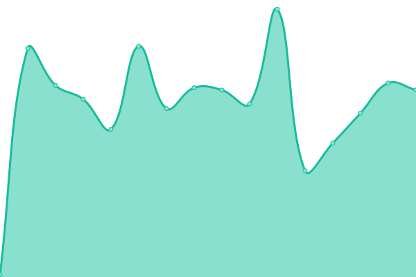 73ms
     
 | 

<a href="https://AlonsoK28.github.io/xadani-upptime/history/xadani-stripe-create-chekout">95.88%</a>
    

|  [xadani-stripe-create-payment-intent](https://www.xadani.com.mx/create-payment-intent) | 🟩 Up | [xadani-stripe-create-payment-intent.yml](https://github.com/AlonsoK28/xadani-upptime/commits/HEAD/history/xadani-stripe-create-payment-intent.yml) | 

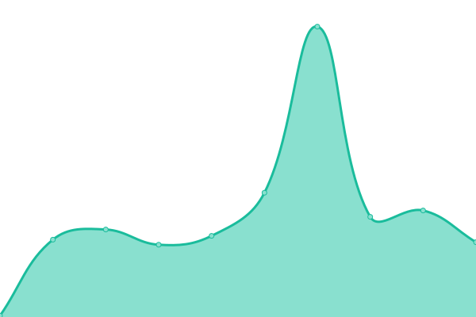 79ms
     
 | 

<a href="https://AlonsoK28.github.io/xadani-upptime/history/xadani-stripe-create-payment-intent">95.91%</a>
    

|  [xadani-stripe-order-details](https://www.xadani.com.mx/v2/order-details/pi_3SQGuWPA8RIEn4T31Y9oW0wQ) | 🟥 Down | [xadani-stripe-order-details.yml](https://github.com/AlonsoK28/xadani-upptime/commits/HEAD/history/xadani-stripe-order-details.yml) | 

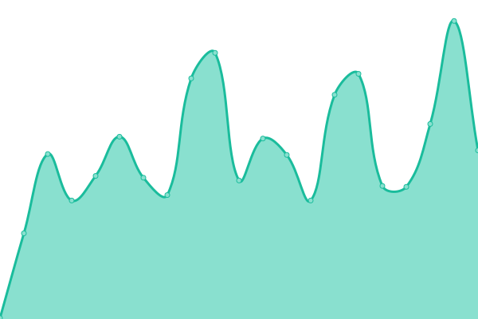 149ms
     
 | 

<a href="https://AlonsoK28.github.io/xadani-upptime/history/xadani-stripe-order-details">100.00%</a>
    

|  [xadani-stripe-webhook](https://www.xadani.com.mx/webhook-stripe) | 🟩 Up | [xadani-stripe-webhook.yml](https://github.com/AlonsoK28/xadani-upptime/commits/HEAD/history/xadani-stripe-webhook.yml) | 

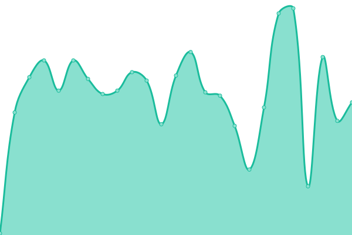 78ms
     
 | 

<a href="https://AlonsoK28.github.io/xadani-upptime/history/xadani-stripe-webhook">95.97%</a>
    

|  [xadani-admin-api-batch](https://www.xadani.com.mx/modulos/controller/api/v2/batch.php) | 🟩 Up | [xadani-admin-api-batch.yml](https://github.com/AlonsoK28/xadani-upptime/commits/HEAD/history/xadani-admin-api-batch.yml) | 

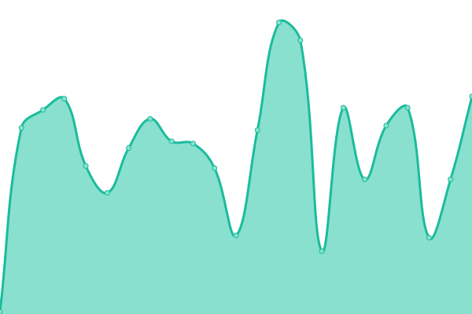 74ms
     
 | 

<a href="https://AlonsoK28.github.io/xadani-upptime/history/xadani-admin-api-batch">96.00%</a>
    

|  [xadani-admin-api-keywords](https://www.xadani.com.mx/modulos/controller/api/v2/keywords.php) | 🟩 Up | [xadani-admin-api-keywords.yml](https://github.com/AlonsoK28/xadani-upptime/commits/HEAD/history/xadani-admin-api-keywords.yml) | 

 78ms
     
 | 

<a href="https://AlonsoK28.github.io/xadani-upptime/history/xadani-admin-api-keywords">96.03%</a>
    

|  [xadani-product-1](https://www.xadani.com.mx/griddler-de-color-plata/p) | 🟩 Up | [xadani-product-1.yml](https://github.com/AlonsoK28/xadani-upptime/commits/HEAD/history/xadani-product-1.yml) | 

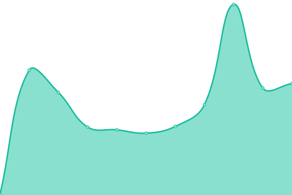 158ms
     
 | 

<a href="https://AlonsoK28.github.io/xadani-upptime/history/xadani-product-1">96.06%</a>
    

|  [xadani-product-2](https://www.xadani.com.mx/dispensador-de-doble-camara/p) | 🟩 Up | [xadani-product-2.yml](https://github.com/AlonsoK28/xadani-upptime/commits/HEAD/history/xadani-product-2.yml) | 

 144ms
     
 | 

<a href="https://AlonsoK28.github.io/xadani-upptime/history/xadani-product-2">96.08%</a>
    

|  [xadani-service-1-title](https://www.xadani.com.mx/servicio-de-instalacion-de-barreras-vehiculares/s) | 🟩 Up | [xadani-service-1-title.yml](https://github.com/AlonsoK28/xadani-upptime/commits/HEAD/history/xadani-service-1-title.yml) | 

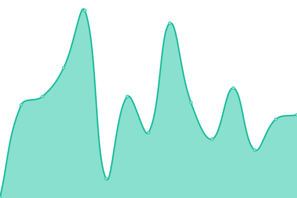 220ms
     
 | 

<a href="https://AlonsoK28.github.io/xadani-upptime/history/xadani-service-1-title">96.11%</a>
    

|  [xadani-service-1-description](https://www.xadani.com.mx/servicio-de-instalacion-de-barreras-vehiculares/s) | 🟩 Up | [xadani-service-1-description.yml](https://github.com/AlonsoK28/xadani-upptime/commits/HEAD/history/xadani-service-1-description.yml) | 

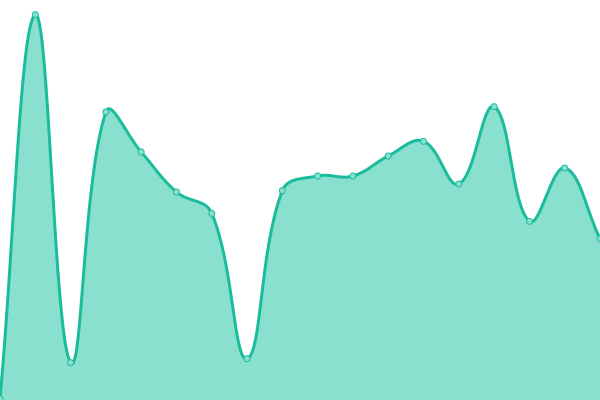 159ms
     
 | 

<a href="https://AlonsoK28.github.io/xadani-upptime/history/xadani-service-1-description">96.14%</a>
    

|  [xadani-service-2-title](https://www.xadani.com.mx/instalacion-plafon-corrido/s) | 🟩 Up | [xadani-service-2-title.yml](https://github.com/AlonsoK28/xadani-upptime/commits/HEAD/history/xadani-service-2-title.yml) | 

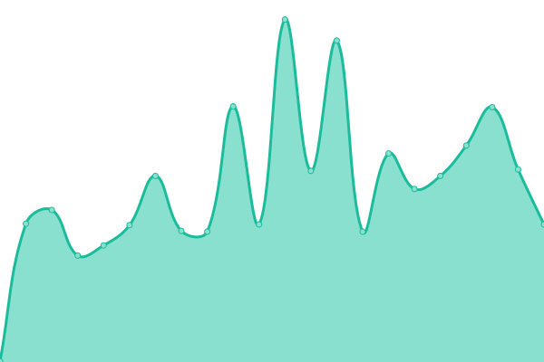 241ms
     
 | 

<a href="https://AlonsoK28.github.io/xadani-upptime/history/xadani-service-2-title">96.17%</a>
    

|  [xadani-service-2-description](https://www.xadani.com.mx/instalacion-plafon-corrido/s) | 🟩 Up | [xadani-service-2-description.yml](https://github.com/AlonsoK28/xadani-upptime/commits/HEAD/history/xadani-service-2-description.yml) | 

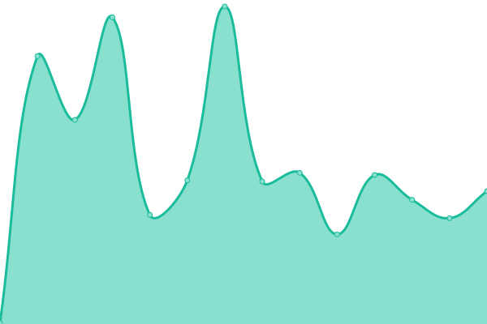 147ms
     
 | 

<a href="https://AlonsoK28.github.io/xadani-upptime/history/xadani-service-2-description">96.20%</a>
    

|  [xadani-ecommerce](https://www.xadani.com.mx/mi-ecommerce.html) | 🟩 Up | [xadani-ecommerce.yml](https://github.com/AlonsoK28/xadani-upptime/commits/HEAD/history/xadani-ecommerce.yml) | 

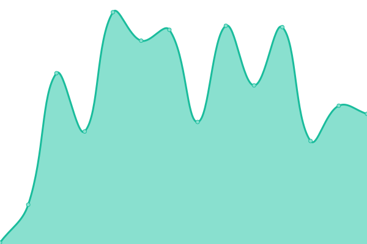 102ms
     
 | 

<a href="https://AlonsoK28.github.io/xadani-upptime/history/xadani-ecommerce">96.23%</a>
    

|  [xadani-list-1](https://www.xadani.com.mx/mejores-marcas-de-herramientas/l) | 🟩 Up | [xadani-list-1.yml](https://github.com/AlonsoK28/xadani-upptime/commits/HEAD/history/xadani-list-1.yml) | 

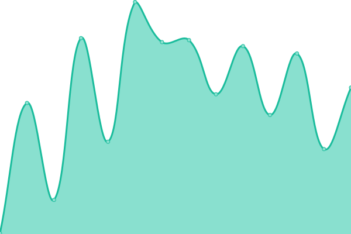 210ms
     
 | 

<a href="https://AlonsoK28.github.io/xadani-upptime/history/xadani-list-1">96.26%</a>
    

|  [xadani-cotizacion](https://www.xadani.com.mx/cotizacion.html) | 🟩 Up | [xadani-cotizacion.yml](https://github.com/AlonsoK28/xadani-upptime/commits/HEAD/history/xadani-cotizacion.yml) | 

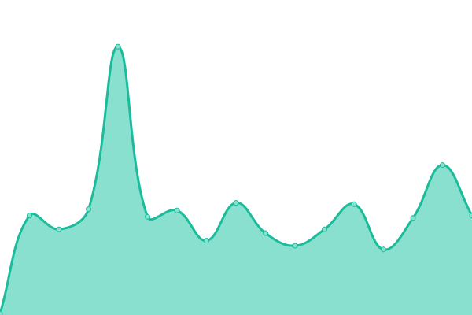 94ms
     
 | 

<a href="https://AlonsoK28.github.io/xadani-upptime/history/xadani-cotizacion">96.29%</a>
    

|  [xadani-contacto](https://www.xadani.com.mx/contacto.html) | 🟩 Up | [xadani-contacto.yml](https://github.com/AlonsoK28/xadani-upptime/commits/HEAD/history/xadani-contacto.yml) | 

 92ms
     
 | 

<a href="https://AlonsoK28.github.io/xadani-upptime/history/xadani-contacto">96.31%</a>
    

|  [xadani-categoria](https://www.xadani.com.mx/categoria/hogar/pagina1.html) | 🟩 Up | [xadani-categoria.yml](https://github.com/AlonsoK28/xadani-upptime/commits/HEAD/history/xadani-categoria.yml) | 

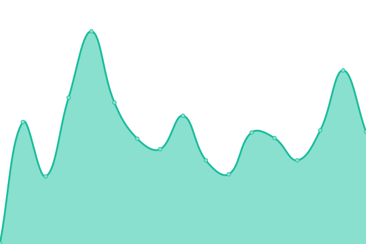 186ms
     
 | 

<a href="https://AlonsoK28.github.io/xadani-upptime/history/xadani-categoria">96.34%</a>
    

|  [xadani-subcategoria](https://www.xadani.com.mx/subcategoria/almacenamiento/pagina1.html) | 🟩 Up | [xadani-subcategoria.yml](https://github.com/AlonsoK28/xadani-upptime/commits/HEAD/history/xadani-subcategoria.yml) | 

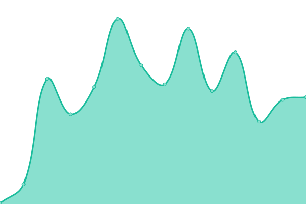 168ms
     
 | 

<a href="https://AlonsoK28.github.io/xadani-upptime/history/xadani-subcategoria">96.37%</a>
    

|  [xadani-busqueda](https://www.xadani.com.mx/buscar/cajas/pagina1.html) | 🟩 Up | [xadani-busqueda.yml](https://github.com/AlonsoK28/xadani-upptime/commits/HEAD/history/xadani-busqueda.yml) | 

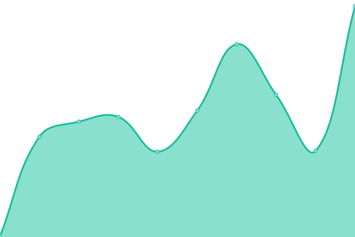 156ms
     
 | 

<a href="https://AlonsoK28.github.io/xadani-upptime/history/xadani-busqueda">96.40%</a>
    

|  [xadani-marca](https://www.xadani.com.mx/marca/sterilite/pagina1.html) | 🟩 Up | [xadani-marca.yml](https://github.com/AlonsoK28/xadani-upptime/commits/HEAD/history/xadani-marca.yml) | 

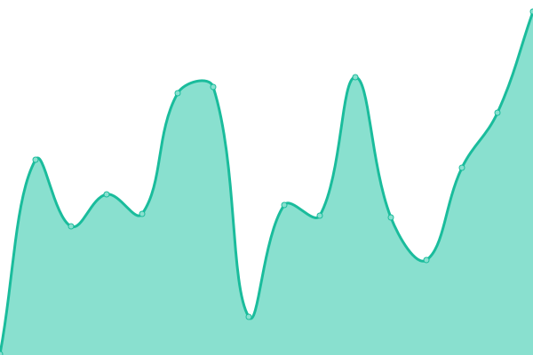 168ms
     
 | 

<a href="https://AlonsoK28.github.io/xadani-upptime/history/xadani-marca">96.43%</a>
    

|  [xadani-subscription](https://www.xadani.com.mx/subscription/cs_live_a1l93RxXyTnP9j1bcOHJQeSDNVH4akRDW1hY77jZChmpwevh2UG6I9iCKz) | 🟩 Up | [xadani-subscription.yml](https://github.com/AlonsoK28/xadani-upptime/commits/HEAD/history/xadani-subscription.yml) | 

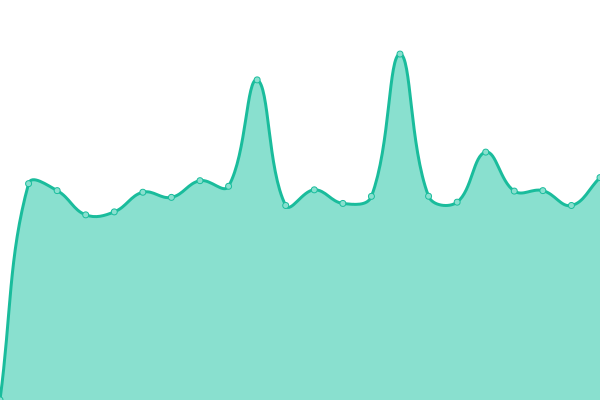 1562ms
     
 | 

<a href="https://AlonsoK28.github.io/xadani-upptime/history/xadani-subscription">96.46%</a>
    

|  [sterilite](https://sterilite.mx) | 🟩 Up | [sterilite.yml](https://github.com/AlonsoK28/xadani-upptime/commits/HEAD/history/sterilite.yml) | 

 666ms
     
 | 

<a href="https://AlonsoK28.github.io/xadani-upptime/history/sterilite">96.49%</a>
    

|  [sterilite-api](https://sterilite.mx/api/producto/cajas%20de%20plastico) | 🟩 Up | [sterilite-api.yml](https://github.com/AlonsoK28/xadani-upptime/commits/HEAD/history/sterilite-api.yml) | 

 84ms
     
 | 

<a href="https://AlonsoK28.github.io/xadani-upptime/history/sterilite-api">96.51%</a>
    

|  [sterilite-stripe-create-chekout](https://sterilite.mx/create-checkout-stripe) | 🟩 Up | [sterilite-stripe-create-chekout.yml](https://github.com/AlonsoK28/xadani-upptime/commits/HEAD/history/sterilite-stripe-create-chekout.yml) | 

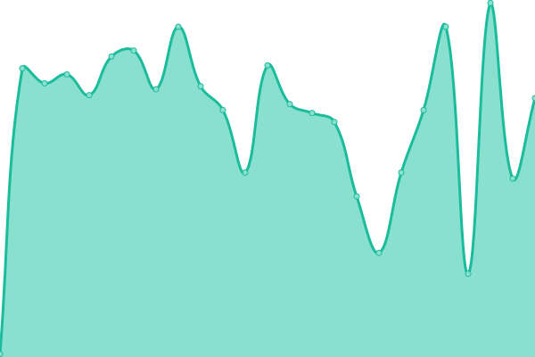 74ms
     
 | 

<a href="https://AlonsoK28.github.io/xadani-upptime/history/sterilite-stripe-create-chekout">96.54%</a>
    

|  [sterilite-stripe-create-payment-intent](https://sterilite.mx/create-payment-intent) | 🟩 Up | [sterilite-stripe-create-payment-intent.yml](https://github.com/AlonsoK28/xadani-upptime/commits/HEAD/history/sterilite-stripe-create-payment-intent.yml) | 

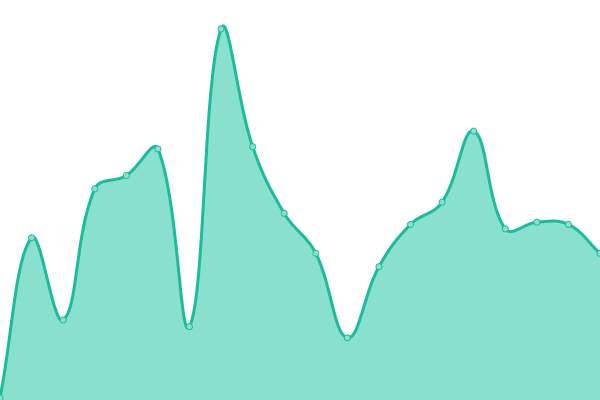 73ms
     
 | 

<a href="https://AlonsoK28.github.io/xadani-upptime/history/sterilite-stripe-create-payment-intent">96.57%</a>
    

|  [sterilite-stripe-checkout-form](https://sterilite.mx/checkout) | 🟩 Up | [sterilite-stripe-checkout-form.yml](https://github.com/AlonsoK28/xadani-upptime/commits/HEAD/history/sterilite-stripe-checkout-form.yml) | 

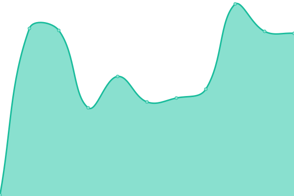 136ms
     
 | 

<a href="https://AlonsoK28.github.io/xadani-upptime/history/sterilite-stripe-checkout-form">96.60%</a>
    

|  [sterilite-stripe-order-details](https://sterilite.mx/v2/order-details/pi_3S47NvLmPLt9oJeN0kPX7FcH) | 🟥 Down | [sterilite-stripe-order-details.yml](https://github.com/AlonsoK28/xadani-upptime/commits/HEAD/history/sterilite-stripe-order-details.yml) | 

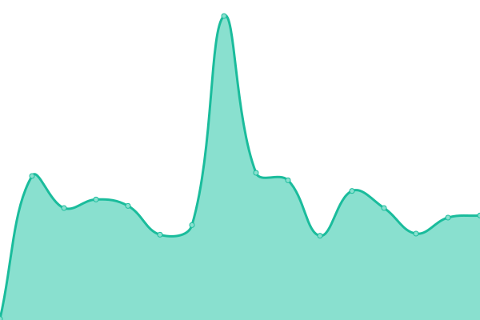 118ms
     
 | 

<a href="https://AlonsoK28.github.io/xadani-upptime/history/sterilite-stripe-order-details">100.00%</a>
    

|  [sterilite-stripe-webhook](https://sterilite.mx/webhook-stripe) | 🟩 Up | [sterilite-stripe-webhook.yml](https://github.com/AlonsoK28/xadani-upptime/commits/HEAD/history/sterilite-stripe-webhook.yml) | 

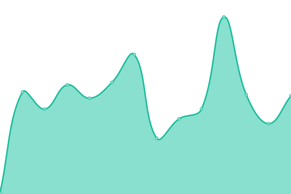 75ms
     
 | 

<a href="https://AlonsoK28.github.io/xadani-upptime/history/sterilite-stripe-webhook">96.66%</a>
    

|  [sterilite-admin-api-batch](https://sterilite.mx/modulos/controller/api/v2/batch.php) | 🟩 Up | [sterilite-admin-api-batch.yml](https://github.com/AlonsoK28/xadani-upptime/commits/HEAD/history/sterilite-admin-api-batch.yml) | 

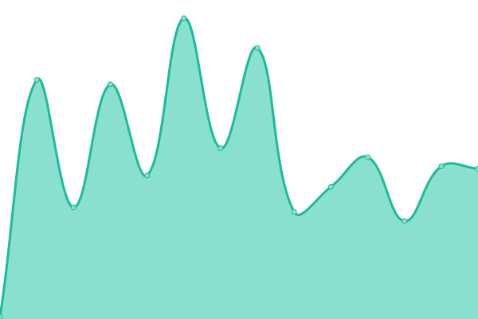 77ms
     
 | 

<a href="https://AlonsoK28.github.io/xadani-upptime/history/sterilite-admin-api-batch">96.69%</a>
    

|  [sterilite-admin-api-keywords](https://sterilite.mx/modulos/controller/api/v2/keywords.php) | 🟩 Up | [sterilite-admin-api-keywords.yml](https://github.com/AlonsoK28/xadani-upptime/commits/HEAD/history/sterilite-admin-api-keywords.yml) | 

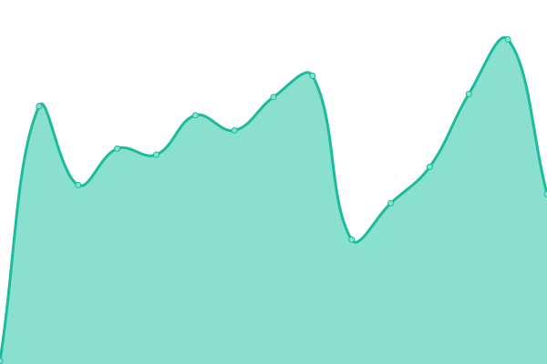 78ms
     
 | 

<a href="https://AlonsoK28.github.io/xadani-upptime/history/sterilite-admin-api-keywords">96.72%</a>
    

|  [sterilite-product-1](https://sterilite.mx/mini-contenedor-de-almacenamiento-sterilite/p) | 🟩 Up | [sterilite-product-1.yml](https://github.com/AlonsoK28/xadani-upptime/commits/HEAD/history/sterilite-product-1.yml) | 

 166ms
     
 | 

<a href="https://AlonsoK28.github.io/xadani-upptime/history/sterilite-product-1">96.75%</a>
    

|  [sterilite-product-2](https://sterilite.mx/caja-con-tapa-de-bisagras-de-uso-rudo-45-litros/p) | 🟩 Up | [sterilite-product-2.yml](https://github.com/AlonsoK28/xadani-upptime/commits/HEAD/history/sterilite-product-2.yml) | 

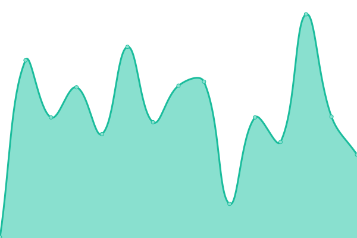 149ms
     
 | 

<a href="https://AlonsoK28.github.io/xadani-upptime/history/sterilite-product-2">96.77%</a>
    

|  [sterilite-list-1-title](https://sterilite.mx/paga-tus-productos-en-linea/l) | 🟩 Up | [sterilite-list-1-title.yml](https://github.com/AlonsoK28/xadani-upptime/commits/HEAD/history/sterilite-list-1-title.yml) | 

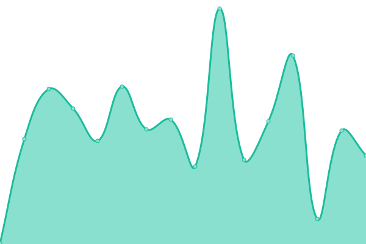 179ms
     
 | 

<a href="https://AlonsoK28.github.io/xadani-upptime/history/sterilite-list-1-title">96.80%</a>
    

|  [sterilite-list-1-description](https://sterilite.mx/paga-tus-productos-en-linea/l) | 🟩 Up | [sterilite-list-1-description.yml](https://github.com/AlonsoK28/xadani-upptime/commits/HEAD/history/sterilite-list-1-description.yml) | 

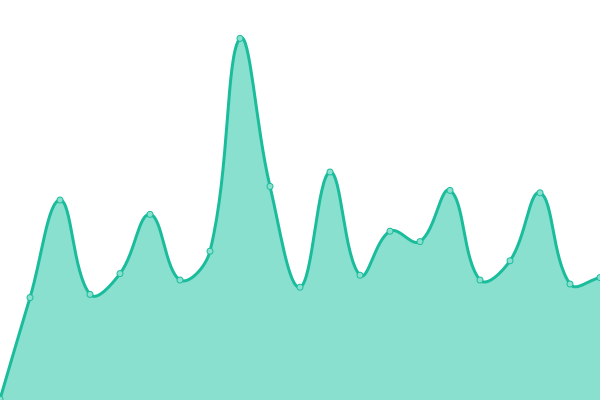 165ms
     
 | 

<a href="https://AlonsoK28.github.io/xadani-upptime/history/sterilite-list-1-description">96.83%</a>
    

|  [cajas-de-plastico](https://cajas-de-plastico.com) | 🟩 Up | [cajas-de-plastico.yml](https://github.com/AlonsoK28/xadani-upptime/commits/HEAD/history/cajas-de-plastico.yml) | 

 693ms
     
 | 

<a href="https://AlonsoK28.github.io/xadani-upptime/history/cajas-de-plastico">96.86%</a>
    

|  [cajas-de-plastico-api](https://cajas-de-plastico.com/api/producto/cajas%20de%20plastico) | 🟩 Up | [cajas-de-plastico-api.yml](https://github.com/AlonsoK28/xadani-upptime/commits/HEAD/history/cajas-de-plastico-api.yml) | 

 93ms
     
 | 

<a href="https://AlonsoK28.github.io/xadani-upptime/history/cajas-de-plastico-api">96.89%</a>
    

|  [cajas-de-plastico-admin-api-batch](https://cajas-de-plastico.com/modulos/controller/api/v2/batch.php) | 🟩 Up | [cajas-de-plastico-admin-api-batch.yml](https://github.com/AlonsoK28/xadani-upptime/commits/HEAD/history/cajas-de-plastico-admin-api-batch.yml) | 

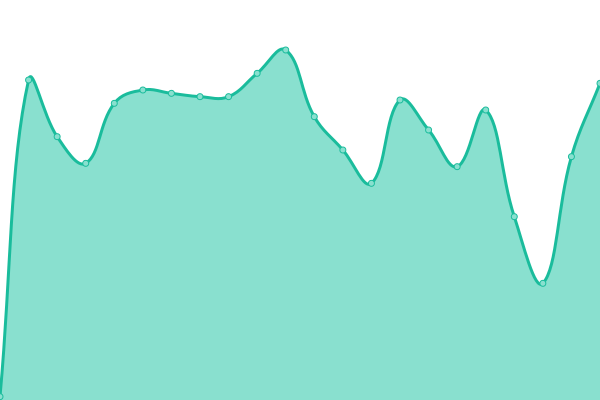 80ms
     
 | 

<a href="https://AlonsoK28.github.io/xadani-upptime/history/cajas-de-plastico-admin-api-batch">96.92%</a>
    

|  [cajas-de-plastico-admin-api-keywords](https://cajas-de-plastico.com/modulos/controller/api/v2/keywords.php) | 🟩 Up | [cajas-de-plastico-admin-api-keywords.yml](https://github.com/AlonsoK28/xadani-upptime/commits/HEAD/history/cajas-de-plastico-admin-api-keywords.yml) | 

 79ms
     
 | 

<a href="https://AlonsoK28.github.io/xadani-upptime/history/cajas-de-plastico-admin-api-keywords">96.95%</a>
    

|  [cajas-de-plastico-product-1](https://cajas-de-plastico.com/contenedor-de-almacenamiento-apilable-rubbermaid/p) | 🟩 Up | [cajas-de-plastico-product-1.yml](https://github.com/AlonsoK28/xadani-upptime/commits/HEAD/history/cajas-de-plastico-product-1.yml) | 

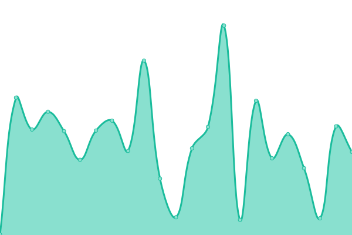 165ms
     
 | 

<a href="https://AlonsoK28.github.io/xadani-upptime/history/cajas-de-plastico-product-1">96.98%</a>
    

|  [cajas-de-plastico-product-2](https://cajas-de-plastico.com/cajas-de-almacenamiento-con-cerradura-de-24-galones-rubbermaid/p) | 🟩 Up | [cajas-de-plastico-product-2.yml](https://github.com/AlonsoK28/xadani-upptime/commits/HEAD/history/cajas-de-plastico-product-2.yml) | 

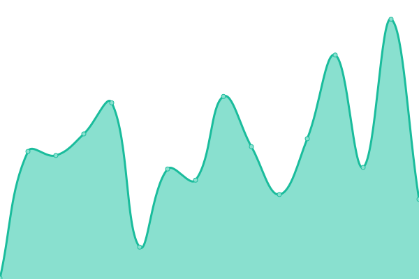 152ms
     
 | 

<a href="https://AlonsoK28.github.io/xadani-upptime/history/cajas-de-plastico-product-2">97.01%</a>
    

|  [cajas-de-plastico-list-1](https://cajas-de-plastico.com/catalogo-de-cajas-de-almacenamiento-de-la-marca-rubbermaid/l) | 🟩 Up | [cajas-de-plastico-list-1.yml](https://github.com/AlonsoK28/xadani-upptime/commits/HEAD/history/cajas-de-plastico-list-1.yml) | 

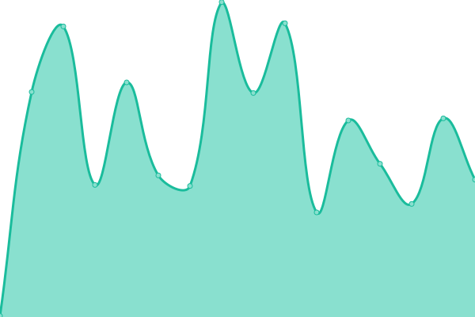 200ms
     
 | 

<a href="https://AlonsoK28.github.io/xadani-upptime/history/cajas-de-plastico-list-1">97.03%</a>
    

|  [barreras-vehiculares](https://barreras-vehiculares.mx) | 🟩 Up | [barreras-vehiculares.yml](https://github.com/AlonsoK28/xadani-upptime/commits/HEAD/history/barreras-vehiculares.yml) | 

 766ms
     
 | 

<a href="https://AlonsoK28.github.io/xadani-upptime/history/barreras-vehiculares">97.06%</a>
    

|  [barreras-vehiculares-api](https://barreras-vehiculares.mx/api/producto/barreras) | 🟩 Up | [barreras-vehiculares-api.yml](https://github.com/AlonsoK28/xadani-upptime/commits/HEAD/history/barreras-vehiculares-api.yml) | 

 83ms
     
 | 

<a href="https://AlonsoK28.github.io/xadani-upptime/history/barreras-vehiculares-api">97.09%</a>
    

|  [barreras-vehiculares-admin-api-batch](https://barreras-vehiculares.mx/modulos/controller/api/v2/batch.php) | 🟩 Up | [barreras-vehiculares-admin-api-batch.yml](https://github.com/AlonsoK28/xadani-upptime/commits/HEAD/history/barreras-vehiculares-admin-api-batch.yml) | 

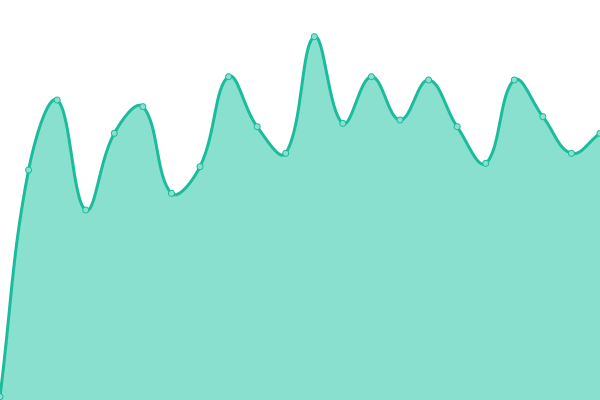 74ms
     
 | 

<a href="https://AlonsoK28.github.io/xadani-upptime/history/barreras-vehiculares-admin-api-batch">97.12%</a>
    

|  [barreras-vehiculares-admin-api-keywords](https://barreras-vehiculares.mx/modulos/controller/api/v2/keywords.php) | 🟩 Up | [barreras-vehiculares-admin-api-keywords.yml](https://github.com/AlonsoK28/xadani-upptime/commits/HEAD/history/barreras-vehiculares-admin-api-keywords.yml) | 

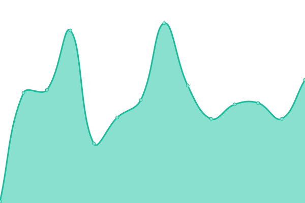 78ms
     
 | 

<a href="https://AlonsoK28.github.io/xadani-upptime/history/barreras-vehiculares-admin-api-keywords">97.15%</a>
    

|  [barreras-vehiculares-product-1](https://barreras-vehiculares.mx/barrera-vehicular-automatica-gard8-para-mastil-de-hasta-7-metros-came/p) | 🟩 Up | [barreras-vehiculares-product-1.yml](https://github.com/AlonsoK28/xadani-upptime/commits/HEAD/history/barreras-vehiculares-product-1.yml) | 

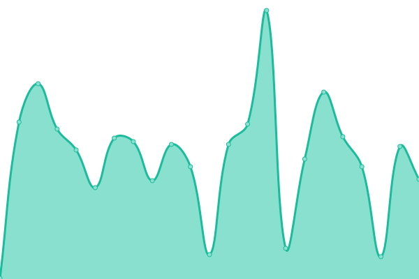 166ms
     
 | 

<a href="https://AlonsoK28.github.io/xadani-upptime/history/barreras-vehiculares-product-1">97.18%</a>
    

|  [barreras-vehiculares-product-2](https://barreras-vehiculares.mx/barrera-vehicular-came-alto-rendimiento-con-brazo-de-hasta-4-mts/p) | 🟩 Up | [barreras-vehiculares-product-2.yml](https://github.com/AlonsoK28/xadani-upptime/commits/HEAD/history/barreras-vehiculares-product-2.yml) | 

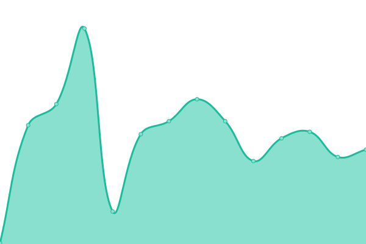 158ms
     
 | 

<a href="https://AlonsoK28.github.io/xadani-upptime/history/barreras-vehiculares-product-2">97.21%</a>
    

|  [barreras-vehiculares-service-1-title](https://barreras-vehiculares.mx/instalacion-de-barreras-vehiculares/s) | 🟩 Up | [barreras-vehiculares-service-1-title.yml](https://github.com/AlonsoK28/xadani-upptime/commits/HEAD/history/barreras-vehiculares-service-1-title.yml) | 

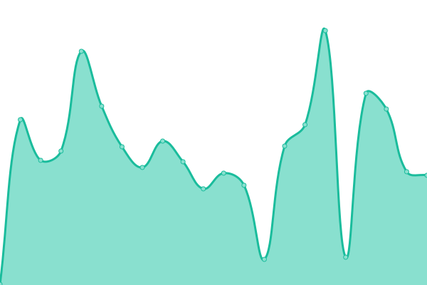 185ms
     
 | 

<a href="https://AlonsoK28.github.io/xadani-upptime/history/barreras-vehiculares-service-1-title">97.24%</a>
    

|  [barreras-vehiculares-service-1-description](https://barreras-vehiculares.mx/instalacion-de-barreras-vehiculares/s) | 🟩 Up | [barreras-vehiculares-service-1-description.yml](https://github.com/AlonsoK28/xadani-upptime/commits/HEAD/history/barreras-vehiculares-service-1-description.yml) | 

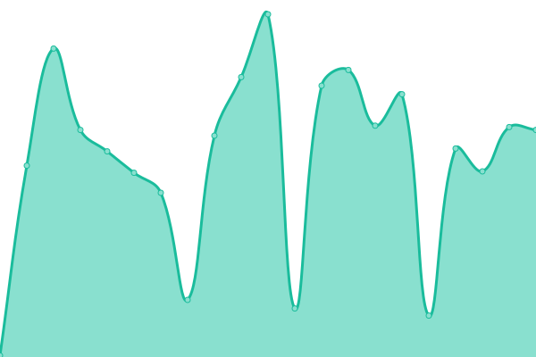 166ms
     
 | 

<a href="https://AlonsoK28.github.io/xadani-upptime/history/barreras-vehiculares-service-1-description">97.26%</a>
    

|  [barreras-vehiculares-service-2-title](https://barreras-vehiculares.mx/servicio-de-instalacion-de-barreras-vehiculares-en-zonas-residenciales/s) | 🟩 Up | [barreras-vehiculares-service-2-title.yml](https://github.com/AlonsoK28/xadani-upptime/commits/HEAD/history/barreras-vehiculares-service-2-title.yml) | 

 182ms
     
 | 

<a href="https://AlonsoK28.github.io/xadani-upptime/history/barreras-vehiculares-service-2-title">97.29%</a>
    

|  [barreras-vehiculares-service-2-description](https://barreras-vehiculares.mx/servicio-de-instalacion-de-barreras-vehiculares-en-zonas-residenciales/s) | 🟩 Up | [barreras-vehiculares-service-2-description.yml](https://github.com/AlonsoK28/xadani-upptime/commits/HEAD/history/barreras-vehiculares-service-2-description.yml) | 

 158ms
     
 | 

<a href="https://AlonsoK28.github.io/xadani-upptime/history/barreras-vehiculares-service-2-description">97.32%</a>
    

|  [verificador-precios](https://verificador-precios.mx) | 🟩 Up | [verificador-precios.yml](https://github.com/AlonsoK28/xadani-upptime/commits/HEAD/history/verificador-precios.yml) | 

 238ms
     
 | 

<a href="https://AlonsoK28.github.io/xadani-upptime/history/verificador-precios">100.00%</a>
    

|  [verificador-precios software](https://verificador-precios.mx/software/) | 🟩 Up | [verificador-precios-software.yml](https://github.com/AlonsoK28/xadani-upptime/commits/HEAD/history/verificador-precios-software.yml) | 

 78ms
     
 | 

<a href="https://AlonsoK28.github.io/xadani-upptime/history/verificador-precios-software">100.00%</a>
    

|  [verificador-precios pospal](https://verificador-precios.mx/verificador-precios-integracion-pospal/) | 🟩 Up | [verificador-precios-pospal.yml](https://github.com/AlonsoK28/xadani-upptime/commits/HEAD/history/verificador-precios-pospal.yml) | 

 75ms
     
 | 

<a href="https://AlonsoK28.github.io/xadani-upptime/history/verificador-precios-pospal">100.00%</a>
    

<!--end: status pages-->

[**Go to xadani-upptime status website →**](https://alonsok28.github.io/xadani-upptime/)

## 📄 License

- Powered by: [Upptime](https://github.com/upptime/upptime)
- Code: [MIT](./LICENSE) © [Upptime](https://upptime.js.org)
- Data in the `./history` directory: [Open Database License](https://opendatacommons.org/licenses/odbl/1-0/)
