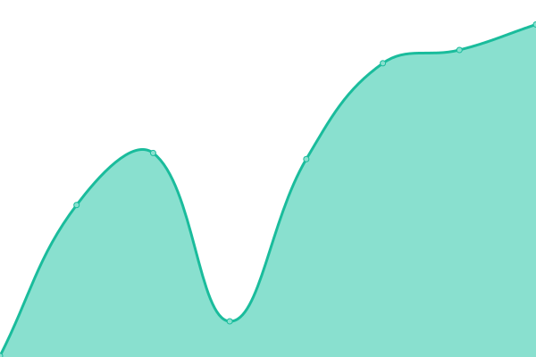
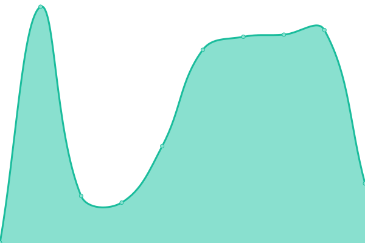
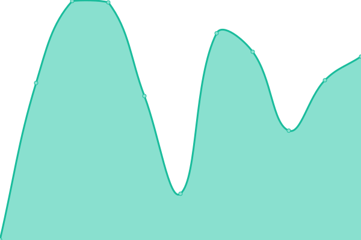

# [📈 Live Status](https://demo.upptime.js.org): <!--live status--> **🟧 Partial outage**

This repository contains the open-source uptime monitor and status page for [Upptime](https://upptime.js.org), powered by [Upptime](https://github.com/upptime/upptime).

With [Upptime](https://upptime.js.org), you can get your own unlimited and free uptime monitor and status page, powered entirely by a GitHub repository. We use [Issues](https://github.com/upptime/upptime/issues) as incident reports, [Actions](https://github.com/AlonsoK28/xadani-upptime/actions) as uptime monitors, and [Pages](https://demo.upptime.js.org) for the status page.

<!--start: status pages-->
<!-- This summary is generated by Upptime (https://github.com/upptime/upptime) -->
<!-- Do not edit this manually, your changes will be overwritten -->
<!-- prettier-ignore -->
| URL | Status | History | Response Time | Uptime |
| --- | ------ | ------- | ------------- | ------ |
|  [xadani](https://www.xadani.com.mx) | 🟥 Down | [xadani.yml](https://github.com/AlonsoK28/xadani-upptime/commits/HEAD/history/xadani.yml) | 

 1707ms
     
 | 

<a href="https://AlonsoK28.github.io/xadani-upptime/history/xadani">98.06%</a>
    

|  [xadani-api](https://www.xadani.com.mx/api/producto/cajas%20de%20plastico) | 🟥 Down | [xadani-api.yml](https://github.com/AlonsoK28/xadani-upptime/commits/HEAD/history/xadani-api.yml) | 

 61ms
     
 | 

<a href="https://AlonsoK28.github.io/xadani-upptime/history/xadani-api">98.08%</a>
    

|  [xadani-email](https://www.xadani.com.mx/modulos/controller/contacto.php?funcion=sendTestingEmail) | 🟥 Down | [xadani-email.yml](https://github.com/AlonsoK28/xadani-upptime/commits/HEAD/history/xadani-email.yml) | 

 199ms
     
 | 

<a href="https://AlonsoK28.github.io/xadani-upptime/history/xadani-email">98.11%</a>
    

|  [sterilite](https://sterilite.mx) | 🟥 Down | [sterilite.yml](https://github.com/AlonsoK28/xadani-upptime/commits/HEAD/history/sterilite.yml) | 

 745ms
     
 | 

<a href="https://AlonsoK28.github.io/xadani-upptime/history/sterilite">98.13%</a>
    

|  [sterilite-api](https://sterilite.mx/api/producto/cajas%20de%20plastico) | 🟥 Down | [sterilite-api.yml](https://github.com/AlonsoK28/xadani-upptime/commits/HEAD/history/sterilite-api.yml) | 

 57ms
     
 | 

<a href="https://AlonsoK28.github.io/xadani-upptime/history/sterilite-api">98.16%</a>
    

|  [cajas-de-plastico](https://cajas-de-plastico.com) | 🟥 Down | [cajas-de-plastico.yml](https://github.com/AlonsoK28/xadani-upptime/commits/HEAD/history/cajas-de-plastico.yml) | 

 1109ms
     
 | 

<a href="https://AlonsoK28.github.io/xadani-upptime/history/cajas-de-plastico">98.18%</a>
    

|  [cajas-de-plastico-api](https://cajas-de-plastico.com/api/producto/cajas%20de%20plastico) | 🟥 Down | [cajas-de-plastico-api.yml](https://github.com/AlonsoK28/xadani-upptime/commits/HEAD/history/cajas-de-plastico-api.yml) | 

 60ms
     
 | 

<a href="https://AlonsoK28.github.io/xadani-upptime/history/cajas-de-plastico-api">98.21%</a>
    

|  [barreras-vehiculares](https://barreras-vehiculares.mx) | 🟥 Down | [barreras-vehiculares.yml](https://github.com/AlonsoK28/xadani-upptime/commits/HEAD/history/barreras-vehiculares.yml) | 

 1131ms
     
 | 

<a href="https://AlonsoK28.github.io/xadani-upptime/history/barreras-vehiculares">98.23%</a>
    

|  [barreras-vehiculares-api](https://barreras-vehiculares.mx/api/producto/barreras) | 🟥 Down | [barreras-vehiculares-api.yml](https://github.com/AlonsoK28/xadani-upptime/commits/HEAD/history/barreras-vehiculares-api.yml) | 

 57ms
     
 | 

<a href="https://AlonsoK28.github.io/xadani-upptime/history/barreras-vehiculares-api">98.25%</a>
    

|  [verificador-precios](https://verificador-precios.mx) | 🟩 Up | [verificador-precios.yml](https://github.com/AlonsoK28/xadani-upptime/commits/HEAD/history/verificador-precios.yml) | 

 558ms
     
 | 

<a href="https://AlonsoK28.github.io/xadani-upptime/history/verificador-precios">100.00%</a>
    

|  [verificador-precios software](https://verificador-precios.mx/software/) | 🟩 Up | [verificador-precios-software.yml](https://github.com/AlonsoK28/xadani-upptime/commits/HEAD/history/verificador-precios-software.yml) | 

 199ms
     
 | 

<a href="https://AlonsoK28.github.io/xadani-upptime/history/verificador-precios-software">100.00%</a>
    

|  [verificador-precios pospal](https://verificador-precios.mx/verificador-precios-integracion-pospal/) | 🟩 Up | [verificador-precios-pospal.yml](https://github.com/AlonsoK28/xadani-upptime/commits/HEAD/history/verificador-precios-pospal.yml) | 

 218ms
     
 | 

<a href="https://AlonsoK28.github.io/xadani-upptime/history/verificador-precios-pospal">100.00%</a>
    

|  [consultoria-angular](https://consultoria-angular.mx) | 🟩 Up | [consultoria-angular.yml](https://github.com/AlonsoK28/xadani-upptime/commits/HEAD/history/consultoria-angular.yml) | 

 566ms
     
 | 

<a href="https://AlonsoK28.github.io/xadani-upptime/history/consultoria-angular">100.00%</a>
    

|  [punto-facturacion](https://punto-facturacion.mx) | 🟩 Up | [punto-facturacion.yml](https://github.com/AlonsoK28/xadani-upptime/commits/HEAD/history/punto-facturacion.yml) | 

 524ms
     
 | 

<a href="https://AlonsoK28.github.io/xadani-upptime/history/punto-facturacion">100.00%</a>
    

<!--end: status pages-->

[**Go to xadani-upptime status website →**](https://alonsok28.github.io/xadani-upptime/)

## 📄 License

- Powered by: [Upptime](https://github.com/upptime/upptime)
- Code: [MIT](./LICENSE) © [Upptime](https://upptime.js.org)
- Data in the `./history` directory: [Open Database License](https://opendatacommons.org/licenses/odbl/1-0/)
