# [📈 Live Status](https://demo.upptime.js.org): <!--live status--> **🟧 Partial outage**

This repository contains the open-source uptime monitor and status page for [Upptime](https://upptime.js.org), powered by [Upptime](https://github.com/upptime/upptime).

With [Upptime](https://upptime.js.org), you can get your own unlimited and free uptime monitor and status page, powered entirely by a GitHub repository. We use [Issues](https://github.com/upptime/upptime/issues) as incident reports, [Actions](https://github.com/AlonsoK28/xadani-upptime/actions) as uptime monitors, and [Pages](https://demo.upptime.js.org) for the status page.

<!--start: status pages-->
<!-- This summary is generated by Upptime (https://github.com/upptime/upptime) -->
<!-- Do not edit this manually, your changes will be overwritten -->
<!-- prettier-ignore -->
| URL | Status | History | Response Time | Uptime |
| --- | ------ | ------- | ------------- | ------ |
|  [xadani](https://www.xadani.com.mx) | 🟩 Up | [xadani.yml](https://github.com/AlonsoK28/xadani-upptime/commits/HEAD/history/xadani.yml) | 

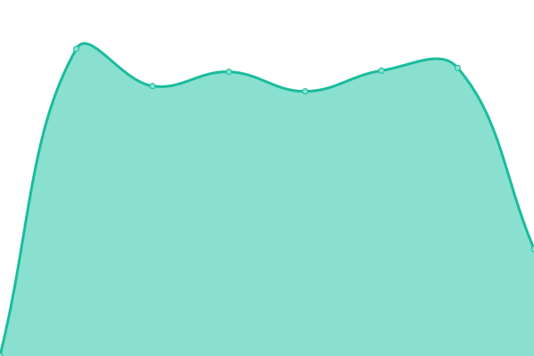 827ms
     
 | 

<a href="https://AlonsoK28.github.io/xadani-upptime/history/xadani">82.31%</a>
    

|  [xadani-api](https://www.xadani.com.mx/api/producto/cajas%20de%20plastico) | 🟩 Up | [xadani-api.yml](https://github.com/AlonsoK28/xadani-upptime/commits/HEAD/history/xadani-api.yml) | 

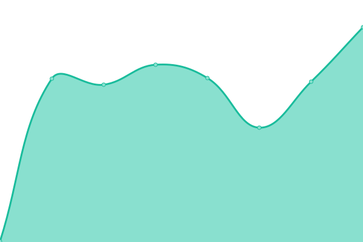 89ms
     
 | 

<a href="https://AlonsoK28.github.io/xadani-upptime/history/xadani-api">82.36%</a>
    

|  xadani-email | 🟥 Down | [xadani-email.yml](https://github.com/AlonsoK28/xadani-upptime/commits/HEAD/history/xadani-email.yml) | 

 386ms
     
 | 

<a href="https://AlonsoK28.github.io/xadani-upptime/history/xadani-email">0.00%</a>
    

|  [xadani-stripe-create-chekout](https://www.xadani.com.mx/create-checkout-stripe) | 🟩 Up | [xadani-stripe-create-chekout.yml](https://github.com/AlonsoK28/xadani-upptime/commits/HEAD/history/xadani-stripe-create-chekout.yml) | 

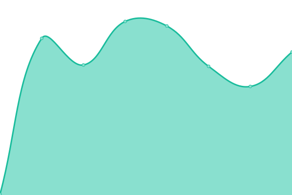 71ms
     
 | 

<a href="https://AlonsoK28.github.io/xadani-upptime/history/xadani-stripe-create-chekout">82.44%</a>
    

|  [xadani-stripe-create-payment-intent](https://www.xadani.com.mx/create-payment-intent) | 🟩 Up | [xadani-stripe-create-payment-intent.yml](https://github.com/AlonsoK28/xadani-upptime/commits/HEAD/history/xadani-stripe-create-payment-intent.yml) | 

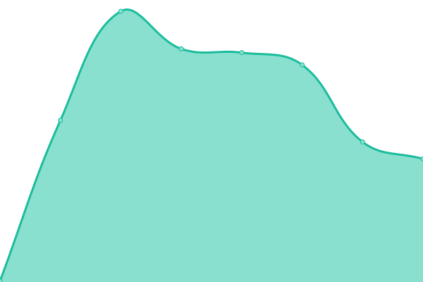 76ms
     
 | 

<a href="https://AlonsoK28.github.io/xadani-upptime/history/xadani-stripe-create-payment-intent">82.49%</a>
    

|  [xadani-stripe-checkout-form](https://www.xadani.com.mx/checkout) | 🟩 Up | [xadani-stripe-checkout-form.yml](https://github.com/AlonsoK28/xadani-upptime/commits/HEAD/history/xadani-stripe-checkout-form.yml) | 

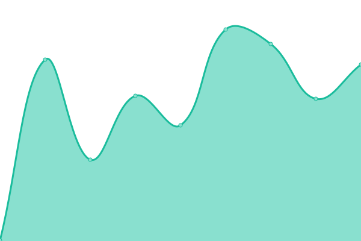 132ms
     
 | 

<a href="https://AlonsoK28.github.io/xadani-upptime/history/xadani-stripe-checkout-form">82.53%</a>
    

|  [sterilite-stripe-checkout-form-by-id-price-checker-1](https://www.xadani.com.mx/checkout-product/verificador-de-precios-modelo-empresarial/) | 🟩 Up | [sterilite-stripe-checkout-form-by-id-price-checker-1.yml](https://github.com/AlonsoK28/xadani-upptime/commits/HEAD/history/sterilite-stripe-checkout-form-by-id-price-checker-1.yml) | 

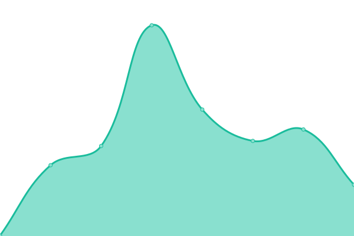 126ms
     
 | 

<a href="https://AlonsoK28.github.io/xadani-upptime/history/sterilite-stripe-checkout-form-by-id-price-checker-1">100.00%</a>
    

|  [sterilite-stripe-checkout-form-by-id-price-checker-2](https://www.xadani.com.mx/checkout-product/dispositivo-verificador-de-precios-modelo-profesional/) | 🟩 Up | [sterilite-stripe-checkout-form-by-id-price-checker-2.yml](https://github.com/AlonsoK28/xadani-upptime/commits/HEAD/history/sterilite-stripe-checkout-form-by-id-price-checker-2.yml) | 

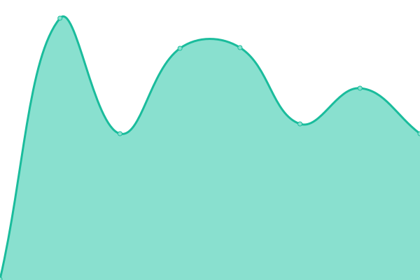 116ms
     
 | 

<a href="https://AlonsoK28.github.io/xadani-upptime/history/sterilite-stripe-checkout-form-by-id-price-checker-2">100.00%</a>
    

|  [sterilite-stripe-checkout-form-by-code](https://www.xadani.com.mx/checkout-products/18/21/22/3/) | 🟩 Up | [sterilite-stripe-checkout-form-by-code.yml](https://github.com/AlonsoK28/xadani-upptime/commits/HEAD/history/sterilite-stripe-checkout-form-by-code.yml) | 

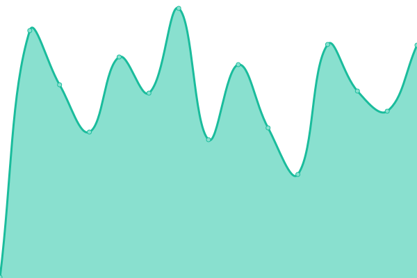 115ms
     
 | 

<a href="https://AlonsoK28.github.io/xadani-upptime/history/sterilite-stripe-checkout-form-by-code">82.66%</a>
    

|  [xadani-stripe-order-details](https://www.xadani.com.mx/v2/order-details/pi_3SQGuWPA8RIEn4T31Y9oW0wQ) | 🟩 Up | [xadani-stripe-order-details.yml](https://github.com/AlonsoK28/xadani-upptime/commits/HEAD/history/xadani-stripe-order-details.yml) | 

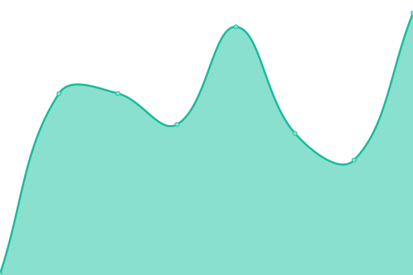 132ms
     
 | 

<a href="https://AlonsoK28.github.io/xadani-upptime/history/xadani-stripe-order-details">82.71%</a>
    

|  [xadani-stripe-webhook](https://www.xadani.com.mx/webhook-stripe) | 🟩 Up | [xadani-stripe-webhook.yml](https://github.com/AlonsoK28/xadani-upptime/commits/HEAD/history/xadani-stripe-webhook.yml) | 

 76ms
     
 | 

<a href="https://AlonsoK28.github.io/xadani-upptime/history/xadani-stripe-webhook">82.75%</a>
    

|  [xadani-admin-api-batch](https://www.xadani.com.mx/modulos/controller/api/v2/batch.php) | 🟩 Up | [xadani-admin-api-batch.yml](https://github.com/AlonsoK28/xadani-upptime/commits/HEAD/history/xadani-admin-api-batch.yml) | 

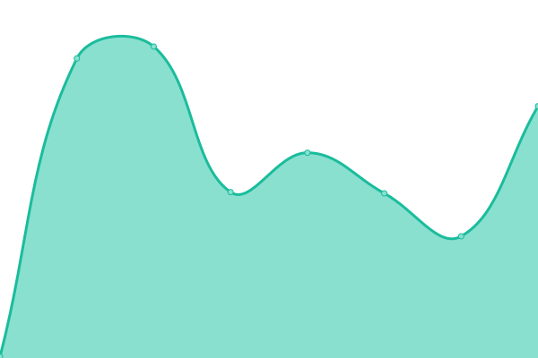 69ms
     
 | 

<a href="https://AlonsoK28.github.io/xadani-upptime/history/xadani-admin-api-batch">82.79%</a>
    

|  [xadani-api-shipping-details-by-code](https://www.xadani.com.mx/api/v2/checkout/shipping-details-by-zip-code/01010) | 🟥 Down | [xadani-api-shipping-details-by-code.yml](https://github.com/AlonsoK28/xadani-upptime/commits/HEAD/history/xadani-api-shipping-details-by-code.yml) | 

 77ms
     
 | 

<a href="https://AlonsoK28.github.io/xadani-upptime/history/xadani-api-shipping-details-by-code">0.00%</a>
    

|  [xadani-admin-api-keywords](https://www.xadani.com.mx/modulos/controller/api/v2/keywords.php) | 🟩 Up | [xadani-admin-api-keywords.yml](https://github.com/AlonsoK28/xadani-upptime/commits/HEAD/history/xadani-admin-api-keywords.yml) | 

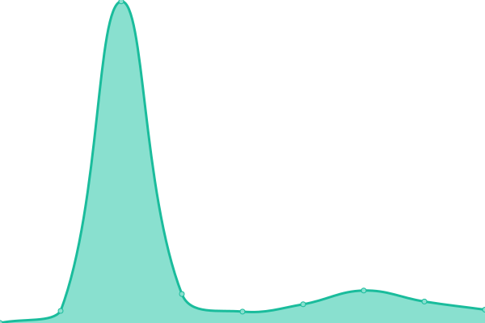 79ms
     
 | 

<a href="https://AlonsoK28.github.io/xadani-upptime/history/xadani-admin-api-keywords">82.88%</a>
    

|  [xadani-product-1](https://www.xadani.com.mx/griddler-de-color-plata/p) | 🟩 Up | [xadani-product-1.yml](https://github.com/AlonsoK28/xadani-upptime/commits/HEAD/history/xadani-product-1.yml) | 

 162ms
     
 | 

<a href="https://AlonsoK28.github.io/xadani-upptime/history/xadani-product-1">82.92%</a>
    

|  [xadani-product-2](https://www.xadani.com.mx/dispensador-de-doble-camara/p) | 🟩 Up | [xadani-product-2.yml](https://github.com/AlonsoK28/xadani-upptime/commits/HEAD/history/xadani-product-2.yml) | 

 144ms
     
 | 

<a href="https://AlonsoK28.github.io/xadani-upptime/history/xadani-product-2">82.97%</a>
    

|  [xadani-service-1-title](https://www.xadani.com.mx/servicio-de-instalacion-de-barreras-vehiculares/s) | 🟩 Up | [xadani-service-1-title.yml](https://github.com/AlonsoK28/xadani-upptime/commits/HEAD/history/xadani-service-1-title.yml) | 

 189ms
     
 | 

<a href="https://AlonsoK28.github.io/xadani-upptime/history/xadani-service-1-title">83.01%</a>
    

|  [xadani-service-1-description](https://www.xadani.com.mx/servicio-de-instalacion-de-barreras-vehiculares/s) | 🟩 Up | [xadani-service-1-description.yml](https://github.com/AlonsoK28/xadani-upptime/commits/HEAD/history/xadani-service-1-description.yml) | 

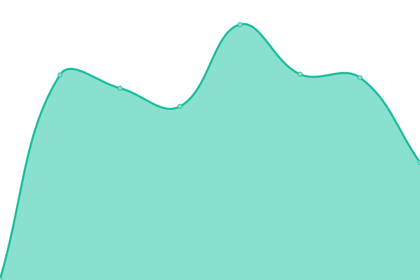 269ms
     
 | 

<a href="https://AlonsoK28.github.io/xadani-upptime/history/xadani-service-1-description">83.05%</a>
    

|  [xadani-service-2-title](https://www.xadani.com.mx/instalacion-plafon-corrido/s) | 🟩 Up | [xadani-service-2-title.yml](https://github.com/AlonsoK28/xadani-upptime/commits/HEAD/history/xadani-service-2-title.yml) | 

 210ms
     
 | 

<a href="https://AlonsoK28.github.io/xadani-upptime/history/xadani-service-2-title">83.09%</a>
    

|  [xadani-service-2-description](https://www.xadani.com.mx/instalacion-plafon-corrido/s) | 🟩 Up | [xadani-service-2-description.yml](https://github.com/AlonsoK28/xadani-upptime/commits/HEAD/history/xadani-service-2-description.yml) | 

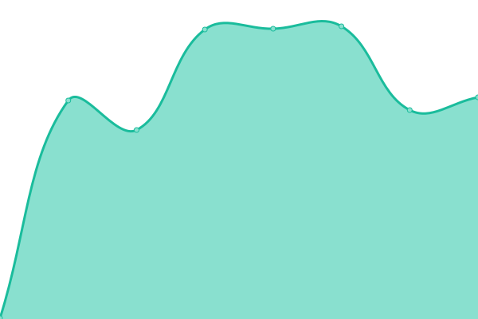 153ms
     
 | 

<a href="https://AlonsoK28.github.io/xadani-upptime/history/xadani-service-2-description">83.14%</a>
    

|  [xadani-ecommerce](https://www.xadani.com.mx/mi-ecommerce.html) | 🟩 Up | [xadani-ecommerce.yml](https://github.com/AlonsoK28/xadani-upptime/commits/HEAD/history/xadani-ecommerce.yml) | 

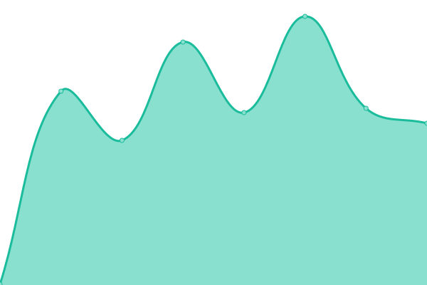 114ms
     
 | 

<a href="https://AlonsoK28.github.io/xadani-upptime/history/xadani-ecommerce">83.18%</a>
    

|  [xadani-list-1](https://www.xadani.com.mx/mejores-marcas-de-herramientas/l) | 🟩 Up | [xadani-list-1.yml](https://github.com/AlonsoK28/xadani-upptime/commits/HEAD/history/xadani-list-1.yml) | 

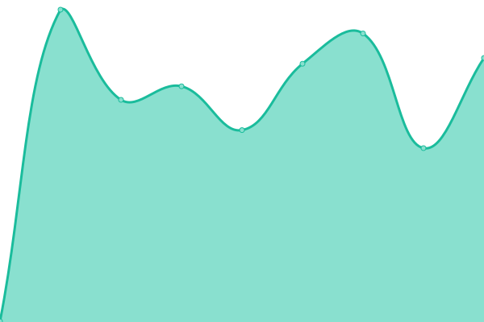 198ms
     
 | 

<a href="https://AlonsoK28.github.io/xadani-upptime/history/xadani-list-1">83.22%</a>
    

|  [xadani-cotizacion](https://www.xadani.com.mx/cotizacion.html) | 🟩 Up | [xadani-cotizacion.yml](https://github.com/AlonsoK28/xadani-upptime/commits/HEAD/history/xadani-cotizacion.yml) | 

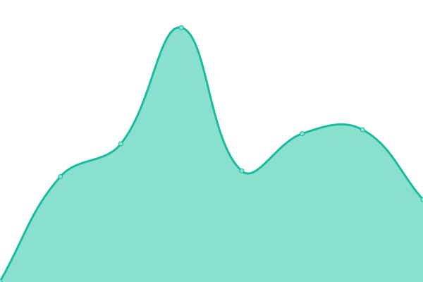 95ms
     
 | 

<a href="https://AlonsoK28.github.io/xadani-upptime/history/xadani-cotizacion">83.27%</a>
    

|  [xadani-contacto](https://www.xadani.com.mx/contacto.html) | 🟩 Up | [xadani-contacto.yml](https://github.com/AlonsoK28/xadani-upptime/commits/HEAD/history/xadani-contacto.yml) | 

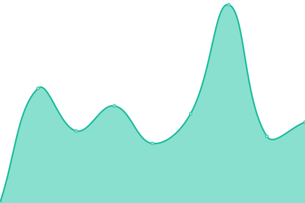 96ms
     
 | 

<a href="https://AlonsoK28.github.io/xadani-upptime/history/xadani-contacto">83.31%</a>
    

|  [xadani-categoria](https://www.xadani.com.mx/categoria/hogar/pagina1.html) | 🟩 Up | [xadani-categoria.yml](https://github.com/AlonsoK28/xadani-upptime/commits/HEAD/history/xadani-categoria.yml) | 

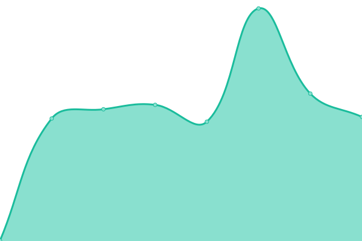 189ms
     
 | 

<a href="https://AlonsoK28.github.io/xadani-upptime/history/xadani-categoria">83.35%</a>
    

|  [xadani-subcategoria](https://www.xadani.com.mx/subcategoria/almacenamiento/pagina1.html) | 🟩 Up | [xadani-subcategoria.yml](https://github.com/AlonsoK28/xadani-upptime/commits/HEAD/history/xadani-subcategoria.yml) | 

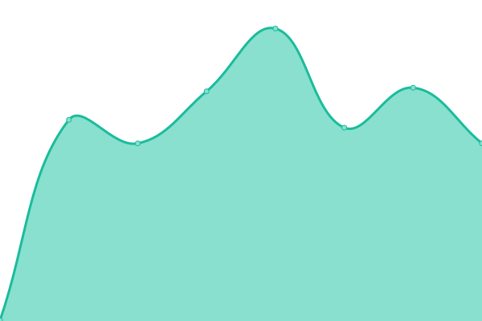 173ms
     
 | 

<a href="https://AlonsoK28.github.io/xadani-upptime/history/xadani-subcategoria">83.40%</a>
    

|  [xadani-search](https://www.xadani.com.mx/search?q=caja+de+plastico) | 🟩 Up | [xadani-search.yml](https://github.com/AlonsoK28/xadani-upptime/commits/HEAD/history/xadani-search.yml) | 

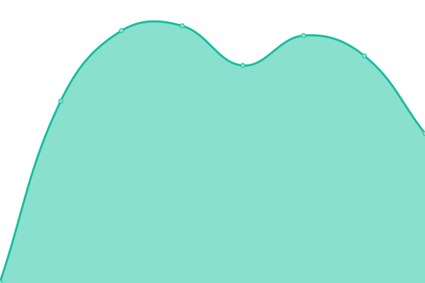 164ms
     
 | 

<a href="https://AlonsoK28.github.io/xadani-upptime/history/xadani-search">83.44%</a>
    

|  [xadani-marca](https://www.xadani.com.mx/marca/sterilite/pagina1.html) | 🟩 Up | [xadani-marca.yml](https://github.com/AlonsoK28/xadani-upptime/commits/HEAD/history/xadani-marca.yml) | 

 169ms
     
 | 

<a href="https://AlonsoK28.github.io/xadani-upptime/history/xadani-marca">83.48%</a>
    

|  [xadani-subscription](https://www.xadani.com.mx/subscription/cs_live_a1l93RxXyTnP9j1bcOHJQeSDNVH4akRDW1hY77jZChmpwevh2UG6I9iCKz) | 🟩 Up | [xadani-subscription.yml](https://github.com/AlonsoK28/xadani-upptime/commits/HEAD/history/xadani-subscription.yml) | 

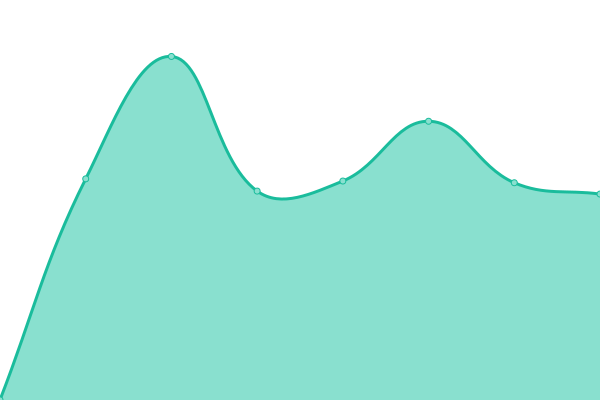 1664ms
     
 | 

<a href="https://AlonsoK28.github.io/xadani-upptime/history/xadani-subscription">83.52%</a>
    

|  [sterilite](https://sterilite.mx) | 🟩 Up | [sterilite.yml](https://github.com/AlonsoK28/xadani-upptime/commits/HEAD/history/sterilite.yml) | 

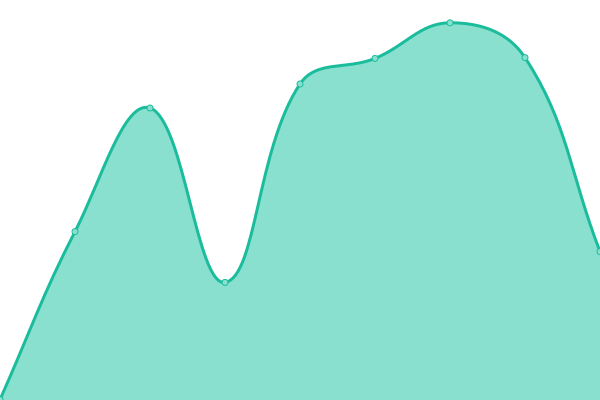 682ms
     
 | 

<a href="https://AlonsoK28.github.io/xadani-upptime/history/sterilite">83.56%</a>
    

|  [sterilite-api](https://sterilite.mx/api/producto/cajas%20de%20plastico) | 🟩 Up | [sterilite-api.yml](https://github.com/AlonsoK28/xadani-upptime/commits/HEAD/history/sterilite-api.yml) | 

 82ms
     
 | 

<a href="https://AlonsoK28.github.io/xadani-upptime/history/sterilite-api">83.61%</a>
    

|  [sterilite-stripe-create-chekout](https://sterilite.mx/create-checkout-stripe) | 🟩 Up | [sterilite-stripe-create-chekout.yml](https://github.com/AlonsoK28/xadani-upptime/commits/HEAD/history/sterilite-stripe-create-chekout.yml) | 

 78ms
     
 | 

<a href="https://AlonsoK28.github.io/xadani-upptime/history/sterilite-stripe-create-chekout">83.65%</a>
    

|  [sterilite-stripe-create-payment-intent](https://sterilite.mx/create-payment-intent) | 🟩 Up | [sterilite-stripe-create-payment-intent.yml](https://github.com/AlonsoK28/xadani-upptime/commits/HEAD/history/sterilite-stripe-create-payment-intent.yml) | 

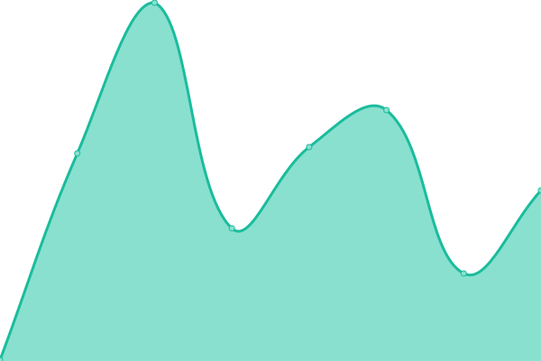 73ms
     
 | 

<a href="https://AlonsoK28.github.io/xadani-upptime/history/sterilite-stripe-create-payment-intent">83.69%</a>
    

|  [sterilite-stripe-checkout-form](https://sterilite.mx/checkout) | 🟩 Up | [sterilite-stripe-checkout-form.yml](https://github.com/AlonsoK28/xadani-upptime/commits/HEAD/history/sterilite-stripe-checkout-form.yml) | 

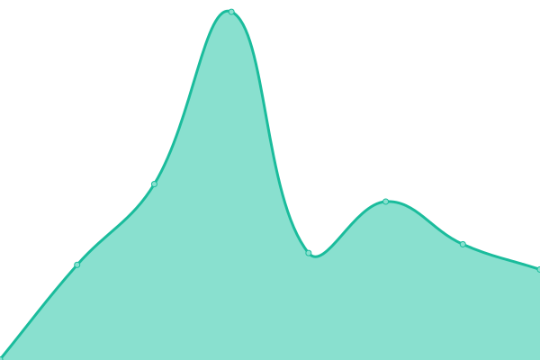 125ms
     
 | 

<a href="https://AlonsoK28.github.io/xadani-upptime/history/sterilite-stripe-checkout-form">83.74%</a>
    

|  [sterilite-stripe-checkout-form-by-id](https://sterilite.mx/checkout-product/contenedor-industrial-almacenamiento/) | 🟩 Up | [sterilite-stripe-checkout-form-by-id.yml](https://github.com/AlonsoK28/xadani-upptime/commits/HEAD/history/sterilite-stripe-checkout-form-by-id.yml) | 

 122ms
     
 | 

<a href="https://AlonsoK28.github.io/xadani-upptime/history/sterilite-stripe-checkout-form-by-id">83.78%</a>
    

|  [sterilite-stripe-checkout-form-by-code](https://sterilite.mx/checkout-products/919458404/900964976/895032698/882000434/797834501/) | 🟩 Up | [sterilite-stripe-checkout-form-by-code.yml](https://github.com/AlonsoK28/xadani-upptime/commits/HEAD/history/sterilite-stripe-checkout-form-by-code.yml) | 

 115ms
     
 | 

<a href="https://AlonsoK28.github.io/xadani-upptime/history/sterilite-stripe-checkout-form-by-code">82.66%</a>
    

|  [sterilite-stripe-order-details](https://sterilite.mx/v2/order-details/pi_3S47NvLmPLt9oJeN0kPX7FcH) | 🟩 Up | [sterilite-stripe-order-details.yml](https://github.com/AlonsoK28/xadani-upptime/commits/HEAD/history/sterilite-stripe-order-details.yml) | 

 107ms
     
 | 

<a href="https://AlonsoK28.github.io/xadani-upptime/history/sterilite-stripe-order-details">83.87%</a>
    

|  [sterilite-stripe-webhook](https://sterilite.mx/webhook-stripe) | 🟩 Up | [sterilite-stripe-webhook.yml](https://github.com/AlonsoK28/xadani-upptime/commits/HEAD/history/sterilite-stripe-webhook.yml) | 

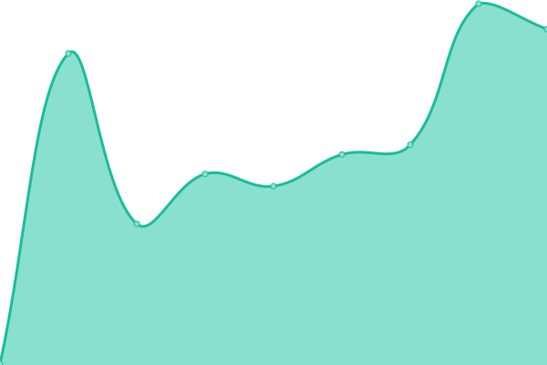 78ms
     
 | 

<a href="https://AlonsoK28.github.io/xadani-upptime/history/sterilite-stripe-webhook">83.91%</a>
    

|  [sterilite-admin-api-batch](https://sterilite.mx/modulos/controller/api/v2/batch.php) | 🟩 Up | [sterilite-admin-api-batch.yml](https://github.com/AlonsoK28/xadani-upptime/commits/HEAD/history/sterilite-admin-api-batch.yml) | 

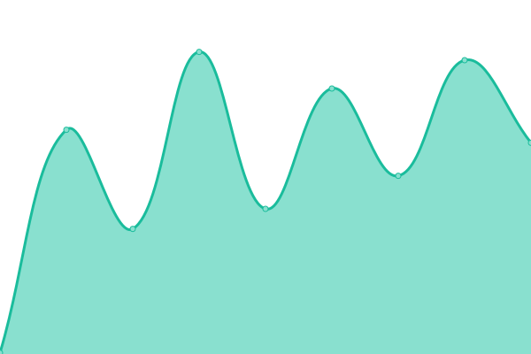 68ms
     
 | 

<a href="https://AlonsoK28.github.io/xadani-upptime/history/sterilite-admin-api-batch">83.95%</a>
    

|  [sterilite-api-shipping-details-by-code](https://sterilite.mx/api/v2/checkout/shipping-details-by-zip-code/01010) | 🟩 Up | [sterilite-api-shipping-details-by-code.yml](https://github.com/AlonsoK28/xadani-upptime/commits/HEAD/history/sterilite-api-shipping-details-by-code.yml) | 

 243ms
     
 | 

<a href="https://AlonsoK28.github.io/xadani-upptime/history/sterilite-api-shipping-details-by-code">84.00%</a>
    

|  [sterilite-admin-api-keywords](https://sterilite.mx/modulos/controller/api/v2/keywords.php) | 🟩 Up | [sterilite-admin-api-keywords.yml](https://github.com/AlonsoK28/xadani-upptime/commits/HEAD/history/sterilite-admin-api-keywords.yml) | 

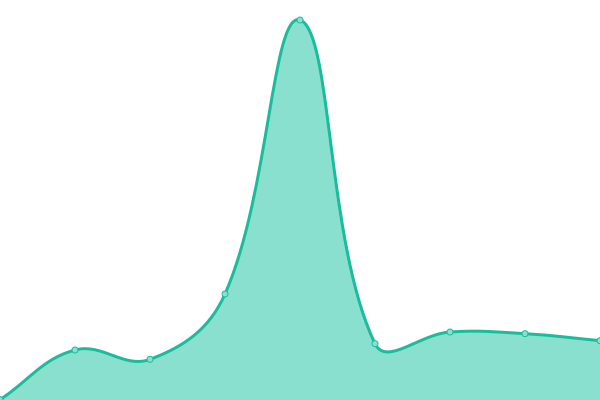 76ms
     
 | 

<a href="https://AlonsoK28.github.io/xadani-upptime/history/sterilite-admin-api-keywords">84.04%</a>
    

|  [sterilite-product-1](https://sterilite.mx/mini-contenedor-de-almacenamiento-sterilite/p) | 🟩 Up | [sterilite-product-1.yml](https://github.com/AlonsoK28/xadani-upptime/commits/HEAD/history/sterilite-product-1.yml) | 

 155ms
     
 | 

<a href="https://AlonsoK28.github.io/xadani-upptime/history/sterilite-product-1">84.08%</a>
    

|  [sterilite-product-2](https://sterilite.mx/caja-con-tapa-de-bisagras-de-uso-rudo-45-litros/p) | 🟩 Up | [sterilite-product-2.yml](https://github.com/AlonsoK28/xadani-upptime/commits/HEAD/history/sterilite-product-2.yml) | 

 135ms
     
 | 

<a href="https://AlonsoK28.github.io/xadani-upptime/history/sterilite-product-2">84.12%</a>
    

|  [sterilite-list-1-title](https://sterilite.mx/paga-tus-productos-en-linea/l) | 🟩 Up | [sterilite-list-1-title.yml](https://github.com/AlonsoK28/xadani-upptime/commits/HEAD/history/sterilite-list-1-title.yml) | 

 174ms
     
 | 

<a href="https://AlonsoK28.github.io/xadani-upptime/history/sterilite-list-1-title">84.17%</a>
    

|  [sterilite-list-1-description](https://sterilite.mx/paga-tus-productos-en-linea/l) | 🟩 Up | [sterilite-list-1-description.yml](https://github.com/AlonsoK28/xadani-upptime/commits/HEAD/history/sterilite-list-1-description.yml) | 

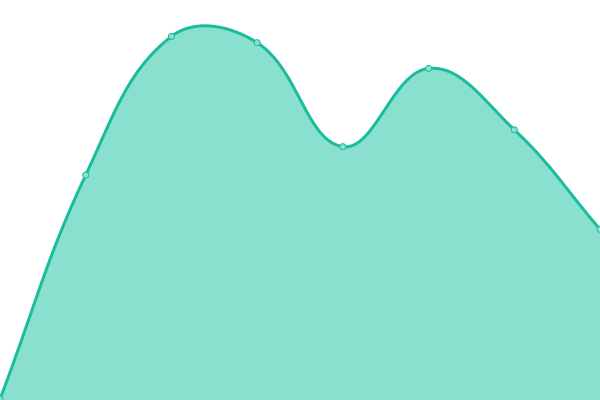 156ms
     
 | 

<a href="https://AlonsoK28.github.io/xadani-upptime/history/sterilite-list-1-description">84.21%</a>
    

|  [sterilite-search](https://sterilite.mx/search?q=sterilite) | 🟩 Up | [sterilite-search.yml](https://github.com/AlonsoK28/xadani-upptime/commits/HEAD/history/sterilite-search.yml) | 

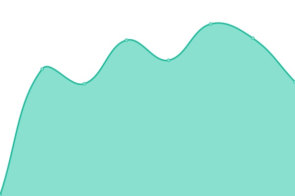 155ms
     
 | 

<a href="https://AlonsoK28.github.io/xadani-upptime/history/sterilite-search">84.25%</a>
    

|  [sterilite-feed-google](https://sterilite.mx/feed-google.xml) | 🟩 Up | [sterilite-feed-google.yml](https://github.com/AlonsoK28/xadani-upptime/commits/HEAD/history/sterilite-feed-google.yml) | 

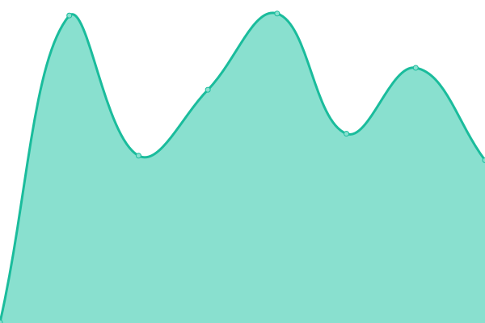 169ms
     
 | 

<a href="https://AlonsoK28.github.io/xadani-upptime/history/sterilite-feed-google">84.30%</a>
    

|  [cajas-de-plastico](https://cajas-de-plastico.com) | 🟩 Up | [cajas-de-plastico.yml](https://github.com/AlonsoK28/xadani-upptime/commits/HEAD/history/cajas-de-plastico.yml) | 

 705ms
     
 | 

<a href="https://AlonsoK28.github.io/xadani-upptime/history/cajas-de-plastico">84.34%</a>
    

|  [cajas-de-plastico-api](https://cajas-de-plastico.com/api/producto/cajas%20de%20plastico) | 🟩 Up | [cajas-de-plastico-api.yml](https://github.com/AlonsoK28/xadani-upptime/commits/HEAD/history/cajas-de-plastico-api.yml) | 

 86ms
     
 | 

<a href="https://AlonsoK28.github.io/xadani-upptime/history/cajas-de-plastico-api">84.38%</a>
    

|  [cajas-de-plastico-admin-api-batch](https://cajas-de-plastico.com/modulos/controller/api/v2/batch.php) | 🟩 Up | [cajas-de-plastico-admin-api-batch.yml](https://github.com/AlonsoK28/xadani-upptime/commits/HEAD/history/cajas-de-plastico-admin-api-batch.yml) | 

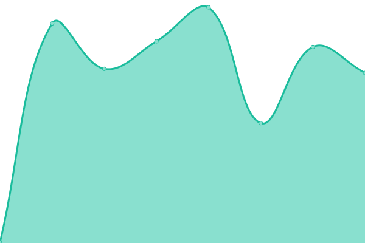 70ms
     
 | 

<a href="https://AlonsoK28.github.io/xadani-upptime/history/cajas-de-plastico-admin-api-batch">84.42%</a>
    

|  [cajas-de-plastico-admin-api-keywords](https://cajas-de-plastico.com/modulos/controller/api/v2/keywords.php) | 🟩 Up | [cajas-de-plastico-admin-api-keywords.yml](https://github.com/AlonsoK28/xadani-upptime/commits/HEAD/history/cajas-de-plastico-admin-api-keywords.yml) | 

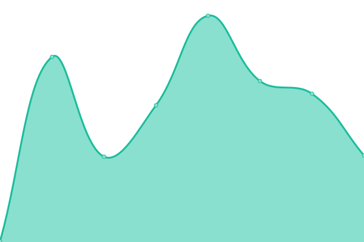 71ms
     
 | 

<a href="https://AlonsoK28.github.io/xadani-upptime/history/cajas-de-plastico-admin-api-keywords">84.47%</a>
    

|  [cajas-de-plastico-product-1](https://cajas-de-plastico.com/contenedor-de-almacenamiento-apilable-rubbermaid/p) | 🟩 Up | [cajas-de-plastico-product-1.yml](https://github.com/AlonsoK28/xadani-upptime/commits/HEAD/history/cajas-de-plastico-product-1.yml) | 

 145ms
     
 | 

<a href="https://AlonsoK28.github.io/xadani-upptime/history/cajas-de-plastico-product-1">84.51%</a>
    

|  [cajas-de-plastico-product-2](https://cajas-de-plastico.com/cajas-de-almacenamiento-con-cerradura-de-24-galones-rubbermaid/p) | 🟩 Up | [cajas-de-plastico-product-2.yml](https://github.com/AlonsoK28/xadani-upptime/commits/HEAD/history/cajas-de-plastico-product-2.yml) | 

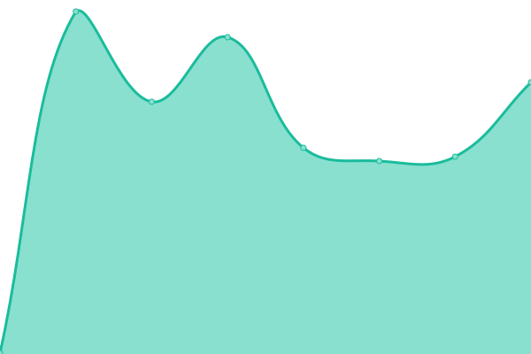 137ms
     
 | 

<a href="https://AlonsoK28.github.io/xadani-upptime/history/cajas-de-plastico-product-2">84.55%</a>
    

|  [cajas-de-plastico-list-1](https://cajas-de-plastico.com/catalogo-de-cajas-de-almacenamiento-de-la-marca-rubbermaid/l) | 🟩 Up | [cajas-de-plastico-list-1.yml](https://github.com/AlonsoK28/xadani-upptime/commits/HEAD/history/cajas-de-plastico-list-1.yml) | 

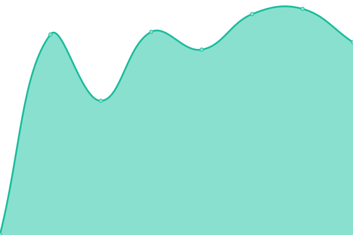 169ms
     
 | 

<a href="https://AlonsoK28.github.io/xadani-upptime/history/cajas-de-plastico-list-1">84.60%</a>
    

|  [cajas-de-plastico-search](https://cajas-de-plastico.com/search?q=cajonera) | 🟩 Up | [cajas-de-plastico-search.yml](https://github.com/AlonsoK28/xadani-upptime/commits/HEAD/history/cajas-de-plastico-search.yml) | 

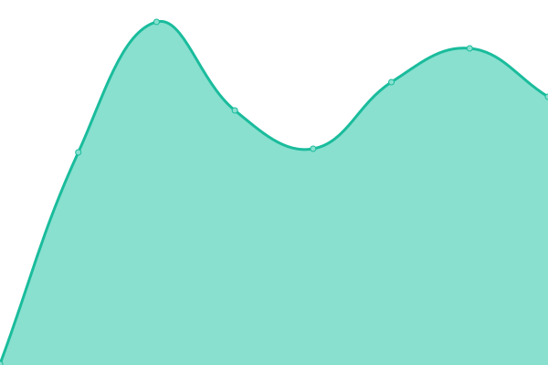 126ms
     
 | 

<a href="https://AlonsoK28.github.io/xadani-upptime/history/cajas-de-plastico-search">84.64%</a>
    

|  [barreras-vehiculares](https://barreras-vehiculares.mx) | 🟥 Down | [barreras-vehiculares.yml](https://github.com/AlonsoK28/xadani-upptime/commits/HEAD/history/barreras-vehiculares.yml) | 

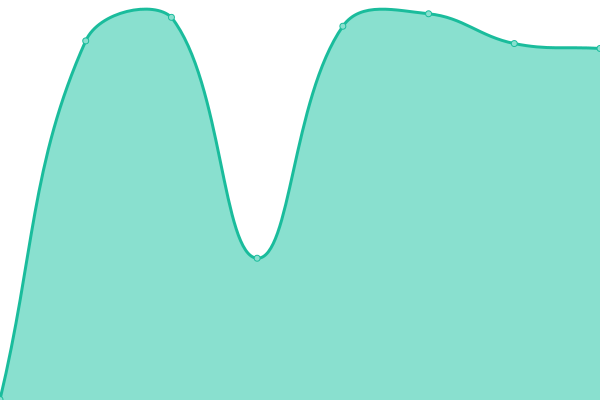 0ms
     
 | 

<a href="https://AlonsoK28.github.io/xadani-upptime/history/barreras-vehiculares">0.00%</a>
    

|  [barreras-vehiculares-api](https://barreras-vehiculares.mx/api/producto/barreras) | 🟥 Down | [barreras-vehiculares-api.yml](https://github.com/AlonsoK28/xadani-upptime/commits/HEAD/history/barreras-vehiculares-api.yml) | 

 0ms
     
 | 

<a href="https://AlonsoK28.github.io/xadani-upptime/history/barreras-vehiculares-api">0.00%</a>
    

|  [barreras-vehiculares-admin-api-batch](https://barreras-vehiculares.mx/modulos/controller/api/v2/batch.php) | 🟥 Down | [barreras-vehiculares-admin-api-batch.yml](https://github.com/AlonsoK28/xadani-upptime/commits/HEAD/history/barreras-vehiculares-admin-api-batch.yml) | 

 0ms
     
 | 

<a href="https://AlonsoK28.github.io/xadani-upptime/history/barreras-vehiculares-admin-api-batch">0.00%</a>
    

|  [barreras-vehiculares-admin-api-keywords](https://barreras-vehiculares.mx/modulos/controller/api/v2/keywords.php) | 🟥 Down | [barreras-vehiculares-admin-api-keywords.yml](https://github.com/AlonsoK28/xadani-upptime/commits/HEAD/history/barreras-vehiculares-admin-api-keywords.yml) | 

 0ms
     
 | 

<a href="https://AlonsoK28.github.io/xadani-upptime/history/barreras-vehiculares-admin-api-keywords">0.00%</a>
    

|  [barreras-vehiculares-product-1](https://barreras-vehiculares.mx/barrera-vehicular-automatica-gard8-para-mastil-de-hasta-7-metros-came/p) | 🟥 Down | [barreras-vehiculares-product-1.yml](https://github.com/AlonsoK28/xadani-upptime/commits/HEAD/history/barreras-vehiculares-product-1.yml) | 

 0ms
     
 | 

<a href="https://AlonsoK28.github.io/xadani-upptime/history/barreras-vehiculares-product-1">0.00%</a>
    

|  [barreras-vehiculares-product-2](https://barreras-vehiculares.mx/barrera-vehicular-came-alto-rendimiento-con-brazo-de-hasta-4-mts/p) | 🟥 Down | [barreras-vehiculares-product-2.yml](https://github.com/AlonsoK28/xadani-upptime/commits/HEAD/history/barreras-vehiculares-product-2.yml) | 

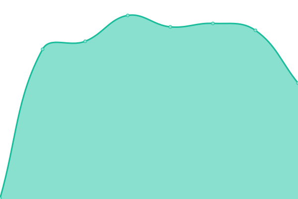 0ms
     
 | 

<a href="https://AlonsoK28.github.io/xadani-upptime/history/barreras-vehiculares-product-2">0.00%</a>
    

|  [barreras-vehiculares-service-1-title](https://barreras-vehiculares.mx/instalacion-de-barreras-vehiculares/s) | 🟥 Down | [barreras-vehiculares-service-1-title.yml](https://github.com/AlonsoK28/xadani-upptime/commits/HEAD/history/barreras-vehiculares-service-1-title.yml) | 

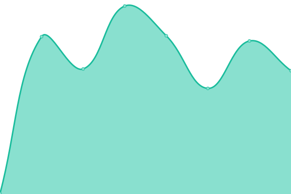 0ms
     
 | 

<a href="https://AlonsoK28.github.io/xadani-upptime/history/barreras-vehiculares-service-1-title">0.00%</a>
    

|  [barreras-vehiculares-service-1-description](https://barreras-vehiculares.mx/instalacion-de-barreras-vehiculares/s) | 🟥 Down | [barreras-vehiculares-service-1-description.yml](https://github.com/AlonsoK28/xadani-upptime/commits/HEAD/history/barreras-vehiculares-service-1-description.yml) | 

 0ms
     
 | 

<a href="https://AlonsoK28.github.io/xadani-upptime/history/barreras-vehiculares-service-1-description">0.00%</a>
    

|  [barreras-vehiculares-service-2-title](https://barreras-vehiculares.mx/servicio-de-instalacion-de-barreras-vehiculares-en-zonas-residenciales/s) | 🟥 Down | [barreras-vehiculares-service-2-title.yml](https://github.com/AlonsoK28/xadani-upptime/commits/HEAD/history/barreras-vehiculares-service-2-title.yml) | 

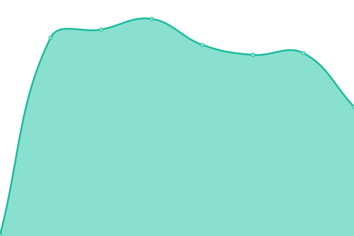 0ms
     
 | 

<a href="https://AlonsoK28.github.io/xadani-upptime/history/barreras-vehiculares-service-2-title">0.00%</a>
    

|  [barreras-vehiculares-service-2-description](https://barreras-vehiculares.mx/servicio-de-instalacion-de-barreras-vehiculares-en-zonas-residenciales/s) | 🟥 Down | [barreras-vehiculares-service-2-description.yml](https://github.com/AlonsoK28/xadani-upptime/commits/HEAD/history/barreras-vehiculares-service-2-description.yml) | 

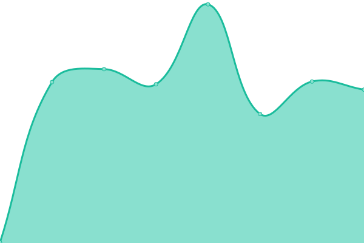 0ms
     
 | 

<a href="https://AlonsoK28.github.io/xadani-upptime/history/barreras-vehiculares-service-2-description">0.00%</a>
    

|  [barreras-vehiculares-search](https://barreras-vehiculares.mx/search?q=barrera) | 🟥 Down | [barreras-vehiculares-search.yml](https://github.com/AlonsoK28/xadani-upptime/commits/HEAD/history/barreras-vehiculares-search.yml) | 

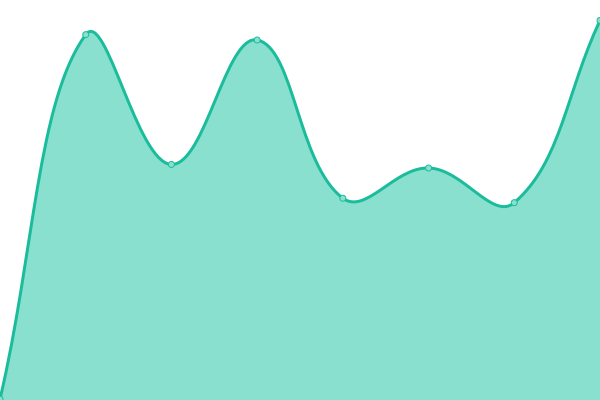 0ms
     
 | 

<a href="https://AlonsoK28.github.io/xadani-upptime/history/barreras-vehiculares-search">0.00%</a>
    

|  [verificador-precios](https://verificador-precios.mx) | 🟩 Up | [verificador-precios.yml](https://github.com/AlonsoK28/xadani-upptime/commits/HEAD/history/verificador-precios.yml) | 

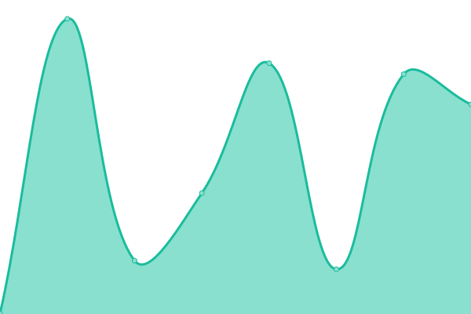 265ms
     
 | 

<a href="https://AlonsoK28.github.io/xadani-upptime/history/verificador-precios">100.00%</a>
    

|  [verificador-precios software](https://verificador-precios.mx/software/) | 🟩 Up | [verificador-precios-software.yml](https://github.com/AlonsoK28/xadani-upptime/commits/HEAD/history/verificador-precios-software.yml) | 

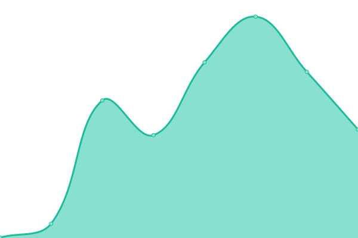 113ms
     
 | 

<a href="https://AlonsoK28.github.io/xadani-upptime/history/verificador-precios-software">100.00%</a>
    

|  [verificador-precios pospal](https://verificador-precios.mx/verificador-precios-integracion-pospal/) | 🟩 Up | [verificador-precios-pospal.yml](https://github.com/AlonsoK28/xadani-upptime/commits/HEAD/history/verificador-precios-pospal.yml) | 

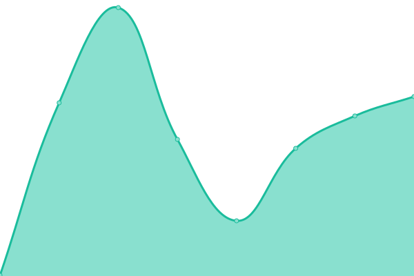 66ms
     
 | 

<a href="https://AlonsoK28.github.io/xadani-upptime/history/verificador-precios-pospal">100.00%</a>
    

|  [xa-cloudinary-api-rest-ping](https://xa-cloudinary-api-rest-ffcgdggedsgzajdg.canadacentral-01.azurewebsites.net/ping) | 🟩 Up | [xa-cloudinary-api-rest-ping.yml](https://github.com/AlonsoK28/xadani-upptime/commits/HEAD/history/xa-cloudinary-api-rest-ping.yml) | 

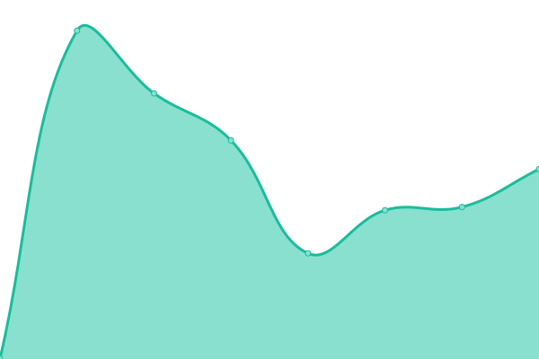 643ms
     
 | 

<a href="https://AlonsoK28.github.io/xadani-upptime/history/xa-cloudinary-api-rest-ping">98.48%</a>
    

|  [xa-cloudinary-api-rest-by-prefix](https://xa-cloudinary-api-rest-ffcgdggedsgzajdg.canadacentral-01.azurewebsites.net/api/cloudinary-images/by-prefix/44) | 🟩 Up | [xa-cloudinary-api-rest-by-prefix.yml](https://github.com/AlonsoK28/xadani-upptime/commits/HEAD/history/xa-cloudinary-api-rest-by-prefix.yml) | 

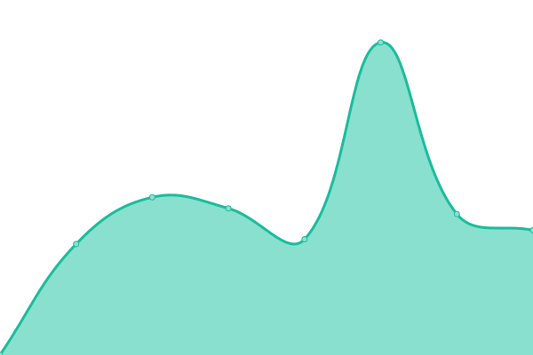 937ms
     
 | 

<a href="https://AlonsoK28.github.io/xadani-upptime/history/xa-cloudinary-api-rest-by-prefix">100.00%</a>
    

|  [xa-cloudinary-api-rest-delete](https://xa-cloudinary-api-rest-ffcgdggedsgzajdg.canadacentral-01.azurewebsites.net/api/cloudinary-images/55555666-1) | 🟩 Up | [xa-cloudinary-api-rest-delete.yml](https://github.com/AlonsoK28/xadani-upptime/commits/HEAD/history/xa-cloudinary-api-rest-delete.yml) | 

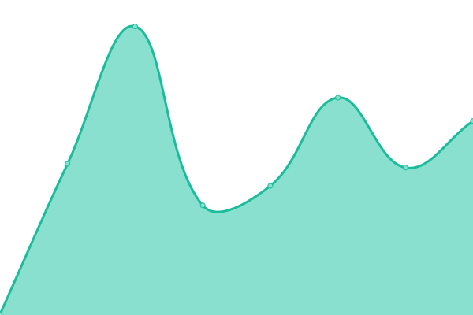 157ms
     
 | 

<a href="https://AlonsoK28.github.io/xadani-upptime/history/xa-cloudinary-api-rest-delete">100.00%</a>
    

|  [xa-cloudinary-api-rest-rename](https://xa-cloudinary-api-rest-ffcgdggedsgzajdg.canadacentral-01.azurewebsites.net/api/cloudinary-images/55555666-333/rename) | 🟩 Up | [xa-cloudinary-api-rest-rename.yml](https://github.com/AlonsoK28/xadani-upptime/commits/HEAD/history/xa-cloudinary-api-rest-rename.yml) | 

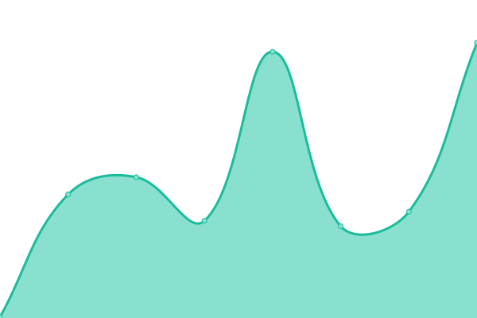 48ms
     
 | 

<a href="https://AlonsoK28.github.io/xadani-upptime/history/xa-cloudinary-api-rest-rename">100.00%</a>
    

|  [xa-cloudinary-api-rest-batch-upload](https://xa-cloudinary-api-rest-ffcgdggedsgzajdg.canadacentral-01.azurewebsites.net/api/cloudinary-images/upload-batch) | 🟩 Up | [xa-cloudinary-api-rest-batch-upload.yml](https://github.com/AlonsoK28/xadani-upptime/commits/HEAD/history/xa-cloudinary-api-rest-batch-upload.yml) | 

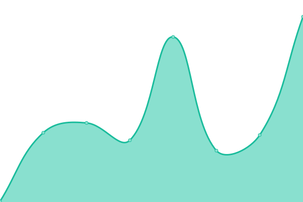 54ms
     
 | 

<a href="https://AlonsoK28.github.io/xadani-upptime/history/xa-cloudinary-api-rest-batch-upload">100.00%</a>
    

<!--end: status pages-->

[**Go to xadani-upptime status website →**](https://alonsok28.github.io/xadani-upptime/)

## 📄 License

- Powered by: [Upptime](https://github.com/upptime/upptime)
- Code: [MIT](./LICENSE) © [Upptime](https://upptime.js.org)
- Data in the `./history` directory: [Open Database License](https://opendatacommons.org/licenses/odbl/1-0/)
