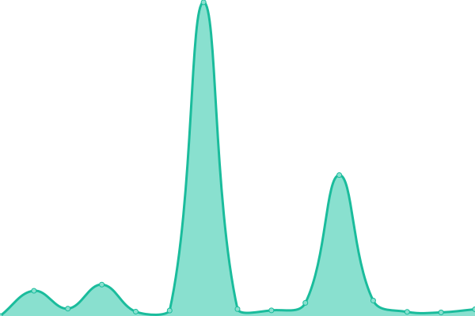

# [📈 Live Status](https://demo.upptime.js.org): <!--live status--> **🟧 Partial outage**

This repository contains the open-source uptime monitor and status page for [Upptime](https://upptime.js.org), powered by [Upptime](https://github.com/upptime/upptime).

With [Upptime](https://upptime.js.org), you can get your own unlimited and free uptime monitor and status page, powered entirely by a GitHub repository. We use [Issues](https://github.com/upptime/upptime/issues) as incident reports, [Actions](https://github.com/AlonsoK28/xadani-upptime/actions) as uptime monitors, and [Pages](https://demo.upptime.js.org) for the status page.

<!--start: status pages-->
<!-- This summary is generated by Upptime (https://github.com/upptime/upptime) -->
<!-- Do not edit this manually, your changes will be overwritten -->
<!-- prettier-ignore -->
| URL | Status | History | Response Time | Uptime |
| --- | ------ | ------- | ------------- | ------ |
|  [xadani](https://www.xadani.com.mx) | 🟩 Up | [xadani.yml](https://github.com/AlonsoK28/xadani-upptime/commits/HEAD/history/xadani.yml) | 

 798ms
     
 | 

<a href="https://AlonsoK28.github.io/xadani-upptime/history/xadani">76.76%</a>
    

|  [xadani-api](https://www.xadani.com.mx/api/producto/cajas%20de%20plastico) | 🟩 Up | [xadani-api.yml](https://github.com/AlonsoK28/xadani-upptime/commits/HEAD/history/xadani-api.yml) | 

 109ms
     
 | 

<a href="https://AlonsoK28.github.io/xadani-upptime/history/xadani-api">76.80%</a>
    

|  [xadani-email](https://www.xadani.com.mx/modulos/controller/contacto.php?funcion=sendTestingEmail) | 🟥 Down | [xadani-email.yml](https://github.com/AlonsoK28/xadani-upptime/commits/HEAD/history/xadani-email.yml) | 

 347ms
     
 | 

<a href="https://AlonsoK28.github.io/xadani-upptime/history/xadani-email">100.00%</a>
    

|  [xadani-stripe-create-chekout](https://www.xadani.com.mx/create-checkout-stripe) | 🟩 Up | [xadani-stripe-create-chekout.yml](https://github.com/AlonsoK28/xadani-upptime/commits/HEAD/history/xadani-stripe-create-chekout.yml) | 

 81ms
     
 | 

<a href="https://AlonsoK28.github.io/xadani-upptime/history/xadani-stripe-create-chekout">77.99%</a>
    

|  [xadani-stripe-create-payment-intent](https://www.xadani.com.mx/create-payment-intent) | 🟩 Up | [xadani-stripe-create-payment-intent.yml](https://github.com/AlonsoK28/xadani-upptime/commits/HEAD/history/xadani-stripe-create-payment-intent.yml) | 

 82ms
     
 | 

<a href="https://AlonsoK28.github.io/xadani-upptime/history/xadani-stripe-create-payment-intent">78.02%</a>
    

|  [xadani-stripe-order-details](https://www.xadani.com.mx/v2/order-details/pi_3SQGuWPA8RIEn4T31Y9oW0wQ) | 🟩 Up | [xadani-stripe-order-details.yml](https://github.com/AlonsoK28/xadani-upptime/commits/HEAD/history/xadani-stripe-order-details.yml) | 

 161ms
     
 | 

<a href="https://AlonsoK28.github.io/xadani-upptime/history/xadani-stripe-order-details">78.05%</a>
    

|  [xadani-stripe-webhook](https://www.xadani.com.mx/webhook-stripe) | 🟩 Up | [xadani-stripe-webhook.yml](https://github.com/AlonsoK28/xadani-upptime/commits/HEAD/history/xadani-stripe-webhook.yml) | 

 76ms
     
 | 

<a href="https://AlonsoK28.github.io/xadani-upptime/history/xadani-stripe-webhook">78.09%</a>
    

|  [xadani-admin-api-batch](https://www.xadani.com.mx/modulos/controller/api/v2/batch.php) | 🟩 Up | [xadani-admin-api-batch.yml](https://github.com/AlonsoK28/xadani-upptime/commits/HEAD/history/xadani-admin-api-batch.yml) | 

 271ms
     
 | 

<a href="https://AlonsoK28.github.io/xadani-upptime/history/xadani-admin-api-batch">78.12%</a>
    

|  [xadani-admin-api-keywords](https://www.xadani.com.mx/modulos/controller/api/v2/keywords.php) | 🟩 Up | [xadani-admin-api-keywords.yml](https://github.com/AlonsoK28/xadani-upptime/commits/HEAD/history/xadani-admin-api-keywords.yml) | 

 77ms
     
 | 

<a href="https://AlonsoK28.github.io/xadani-upptime/history/xadani-admin-api-keywords">78.16%</a>
    

|  [xadani-product-1](https://www.xadani.com.mx/griddler-de-color-plata/p) | 🟩 Up | [xadani-product-1.yml](https://github.com/AlonsoK28/xadani-upptime/commits/HEAD/history/xadani-product-1.yml) | 

 163ms
     
 | 

<a href="https://AlonsoK28.github.io/xadani-upptime/history/xadani-product-1">78.19%</a>
    

|  [xadani-product-2](https://www.xadani.com.mx/dispensador-de-doble-camara/p) | 🟩 Up | [xadani-product-2.yml](https://github.com/AlonsoK28/xadani-upptime/commits/HEAD/history/xadani-product-2.yml) | 

 152ms
     
 | 

<a href="https://AlonsoK28.github.io/xadani-upptime/history/xadani-product-2">78.22%</a>
    

|  [xadani-service-1-title](https://www.xadani.com.mx/servicio-de-instalacion-de-barreras-vehiculares/s) | 🟩 Up | [xadani-service-1-title.yml](https://github.com/AlonsoK28/xadani-upptime/commits/HEAD/history/xadani-service-1-title.yml) | 

 207ms
     
 | 

<a href="https://AlonsoK28.github.io/xadani-upptime/history/xadani-service-1-title">78.26%</a>
    

|  [xadani-service-1-description](https://www.xadani.com.mx/servicio-de-instalacion-de-barreras-vehiculares/s) | 🟩 Up | [xadani-service-1-description.yml](https://github.com/AlonsoK28/xadani-upptime/commits/HEAD/history/xadani-service-1-description.yml) | 

 157ms
     
 | 

<a href="https://AlonsoK28.github.io/xadani-upptime/history/xadani-service-1-description">78.29%</a>
    

|  [xadani-service-2-title](https://www.xadani.com.mx/instalacion-plafon-corrido/s) | 🟩 Up | [xadani-service-2-title.yml](https://github.com/AlonsoK28/xadani-upptime/commits/HEAD/history/xadani-service-2-title.yml) | 

 198ms
     
 | 

<a href="https://AlonsoK28.github.io/xadani-upptime/history/xadani-service-2-title">78.33%</a>
    

|  [xadani-service-2-description](https://www.xadani.com.mx/instalacion-plafon-corrido/s) | 🟩 Up | [xadani-service-2-description.yml](https://github.com/AlonsoK28/xadani-upptime/commits/HEAD/history/xadani-service-2-description.yml) | 

 145ms
     
 | 

<a href="https://AlonsoK28.github.io/xadani-upptime/history/xadani-service-2-description">78.36%</a>
    

|  [xadani-ecommerce](https://www.xadani.com.mx/mi-ecommerce.html) | 🟩 Up | [xadani-ecommerce.yml](https://github.com/AlonsoK28/xadani-upptime/commits/HEAD/history/xadani-ecommerce.yml) | 

 121ms
     
 | 

<a href="https://AlonsoK28.github.io/xadani-upptime/history/xadani-ecommerce">78.39%</a>
    

|  [xadani-list-1](https://www.xadani.com.mx/mejores-marcas-de-herramientas/l) | 🟩 Up | [xadani-list-1.yml](https://github.com/AlonsoK28/xadani-upptime/commits/HEAD/history/xadani-list-1.yml) | 

 220ms
     
 | 

<a href="https://AlonsoK28.github.io/xadani-upptime/history/xadani-list-1">78.43%</a>
    

|  [xadani-cotizacion](https://www.xadani.com.mx/cotizacion.html) | 🟩 Up | [xadani-cotizacion.yml](https://github.com/AlonsoK28/xadani-upptime/commits/HEAD/history/xadani-cotizacion.yml) | 

 96ms
     
 | 

<a href="https://AlonsoK28.github.io/xadani-upptime/history/xadani-cotizacion">78.46%</a>
    

|  [xadani-contacto](https://www.xadani.com.mx/contacto.html) | 🟩 Up | [xadani-contacto.yml](https://github.com/AlonsoK28/xadani-upptime/commits/HEAD/history/xadani-contacto.yml) | 

 96ms
     
 | 

<a href="https://AlonsoK28.github.io/xadani-upptime/history/xadani-contacto">78.50%</a>
    

|  [xadani-categoria](https://www.xadani.com.mx/categoria/hogar/pagina1.html) | 🟩 Up | [xadani-categoria.yml](https://github.com/AlonsoK28/xadani-upptime/commits/HEAD/history/xadani-categoria.yml) | 

 196ms
     
 | 

<a href="https://AlonsoK28.github.io/xadani-upptime/history/xadani-categoria">78.53%</a>
    

|  [xadani-subcategoria](https://www.xadani.com.mx/subcategoria/almacenamiento/pagina1.html) | 🟩 Up | [xadani-subcategoria.yml](https://github.com/AlonsoK28/xadani-upptime/commits/HEAD/history/xadani-subcategoria.yml) | 

 169ms
     
 | 

<a href="https://AlonsoK28.github.io/xadani-upptime/history/xadani-subcategoria">78.56%</a>
    

|  [xadani-search](https://www.xadani.com.mx/search?q=caja+de+plastico) | 🟩 Up | [xadani-search.yml](https://github.com/AlonsoK28/xadani-upptime/commits/HEAD/history/xadani-search.yml) | 

 166ms
     
 | 

<a href="https://AlonsoK28.github.io/xadani-upptime/history/xadani-search">78.60%</a>
    

|  [xadani-marca](https://www.xadani.com.mx/marca/sterilite/pagina1.html) | 🟩 Up | [xadani-marca.yml](https://github.com/AlonsoK28/xadani-upptime/commits/HEAD/history/xadani-marca.yml) | 

 165ms
     
 | 

<a href="https://AlonsoK28.github.io/xadani-upptime/history/xadani-marca">78.63%</a>
    

|  [xadani-subscription](https://www.xadani.com.mx/subscription/cs_live_a1l93RxXyTnP9j1bcOHJQeSDNVH4akRDW1hY77jZChmpwevh2UG6I9iCKz) | 🟩 Up | [xadani-subscription.yml](https://github.com/AlonsoK28/xadani-upptime/commits/HEAD/history/xadani-subscription.yml) | 

 1971ms
     
 | 

<a href="https://AlonsoK28.github.io/xadani-upptime/history/xadani-subscription">78.66%</a>
    

|  [sterilite](https://sterilite.mx) | 🟩 Up | [sterilite.yml](https://github.com/AlonsoK28/xadani-upptime/commits/HEAD/history/sterilite.yml) | 

 677ms
     
 | 

<a href="https://AlonsoK28.github.io/xadani-upptime/history/sterilite">78.70%</a>
    

|  [sterilite-api](https://sterilite.mx/api/producto/cajas%20de%20plastico) | 🟩 Up | [sterilite-api.yml](https://github.com/AlonsoK28/xadani-upptime/commits/HEAD/history/sterilite-api.yml) | 

 79ms
     
 | 

<a href="https://AlonsoK28.github.io/xadani-upptime/history/sterilite-api">78.73%</a>
    

|  [sterilite-stripe-create-chekout](https://sterilite.mx/create-checkout-stripe) | 🟩 Up | [sterilite-stripe-create-chekout.yml](https://github.com/AlonsoK28/xadani-upptime/commits/HEAD/history/sterilite-stripe-create-chekout.yml) | 

 78ms
     
 | 

<a href="https://AlonsoK28.github.io/xadani-upptime/history/sterilite-stripe-create-chekout">78.76%</a>
    

|  [sterilite-stripe-create-payment-intent](https://sterilite.mx/create-payment-intent) | 🟩 Up | [sterilite-stripe-create-payment-intent.yml](https://github.com/AlonsoK28/xadani-upptime/commits/HEAD/history/sterilite-stripe-create-payment-intent.yml) | 

 79ms
     
 | 

<a href="https://AlonsoK28.github.io/xadani-upptime/history/sterilite-stripe-create-payment-intent">78.80%</a>
    

|  [sterilite-stripe-checkout-form](https://sterilite.mx/checkout) | 🟩 Up | [sterilite-stripe-checkout-form.yml](https://github.com/AlonsoK28/xadani-upptime/commits/HEAD/history/sterilite-stripe-checkout-form.yml) | 

 127ms
     
 | 

<a href="https://AlonsoK28.github.io/xadani-upptime/history/sterilite-stripe-checkout-form">78.83%</a>
    

|  [sterilite-stripe-order-details](https://sterilite.mx/v2/order-details/pi_3S47NvLmPLt9oJeN0kPX7FcH) | 🟩 Up | [sterilite-stripe-order-details.yml](https://github.com/AlonsoK28/xadani-upptime/commits/HEAD/history/sterilite-stripe-order-details.yml) | 

 141ms
     
 | 

<a href="https://AlonsoK28.github.io/xadani-upptime/history/sterilite-stripe-order-details">78.87%</a>
    

|  [sterilite-stripe-webhook](https://sterilite.mx/webhook-stripe) | 🟩 Up | [sterilite-stripe-webhook.yml](https://github.com/AlonsoK28/xadani-upptime/commits/HEAD/history/sterilite-stripe-webhook.yml) | 

 78ms
     
 | 

<a href="https://AlonsoK28.github.io/xadani-upptime/history/sterilite-stripe-webhook">78.90%</a>
    

|  [sterilite-admin-api-batch](https://sterilite.mx/modulos/controller/api/v2/batch.php) | 🟩 Up | [sterilite-admin-api-batch.yml](https://github.com/AlonsoK28/xadani-upptime/commits/HEAD/history/sterilite-admin-api-batch.yml) | 

 77ms
     
 | 

<a href="https://AlonsoK28.github.io/xadani-upptime/history/sterilite-admin-api-batch">78.93%</a>
    

|  [sterilite-admin-api-keywords](https://sterilite.mx/modulos/controller/api/v2/keywords.php) | 🟩 Up | [sterilite-admin-api-keywords.yml](https://github.com/AlonsoK28/xadani-upptime/commits/HEAD/history/sterilite-admin-api-keywords.yml) | 

 76ms
     
 | 

<a href="https://AlonsoK28.github.io/xadani-upptime/history/sterilite-admin-api-keywords">78.97%</a>
    

|  [sterilite-product-1](https://sterilite.mx/mini-contenedor-de-almacenamiento-sterilite/p) | 🟩 Up | [sterilite-product-1.yml](https://github.com/AlonsoK28/xadani-upptime/commits/HEAD/history/sterilite-product-1.yml) | 

 157ms
     
 | 

<a href="https://AlonsoK28.github.io/xadani-upptime/history/sterilite-product-1">79.00%</a>
    

|  [sterilite-product-2](https://sterilite.mx/caja-con-tapa-de-bisagras-de-uso-rudo-45-litros/p) | 🟩 Up | [sterilite-product-2.yml](https://github.com/AlonsoK28/xadani-upptime/commits/HEAD/history/sterilite-product-2.yml) | 

 150ms
     
 | 

<a href="https://AlonsoK28.github.io/xadani-upptime/history/sterilite-product-2">79.04%</a>
    

|  [sterilite-list-1-title](https://sterilite.mx/paga-tus-productos-en-linea/l) | 🟩 Up | [sterilite-list-1-title.yml](https://github.com/AlonsoK28/xadani-upptime/commits/HEAD/history/sterilite-list-1-title.yml) | 

 188ms
     
 | 

<a href="https://AlonsoK28.github.io/xadani-upptime/history/sterilite-list-1-title">79.07%</a>
    

|  [sterilite-list-1-description](https://sterilite.mx/paga-tus-productos-en-linea/l) | 🟩 Up | [sterilite-list-1-description.yml](https://github.com/AlonsoK28/xadani-upptime/commits/HEAD/history/sterilite-list-1-description.yml) | 

 174ms
     
 | 

<a href="https://AlonsoK28.github.io/xadani-upptime/history/sterilite-list-1-description">79.10%</a>
    

|  [sterilite-search](https://sterilite.mx/search?q=sterilite) | 🟩 Up | [sterilite-search.yml](https://github.com/AlonsoK28/xadani-upptime/commits/HEAD/history/sterilite-search.yml) | 

 169ms
     
 | 

<a href="https://AlonsoK28.github.io/xadani-upptime/history/sterilite-search">79.14%</a>
    

|  [sterilite-feed-google](https://sterilite.mx/feed-google.xml) | 🟩 Up | [sterilite-feed-google.yml](https://github.com/AlonsoK28/xadani-upptime/commits/HEAD/history/sterilite-feed-google.yml) | 

 161ms
     
 | 

<a href="https://AlonsoK28.github.io/xadani-upptime/history/sterilite-feed-google">79.17%</a>
    

|  [cajas-de-plastico](https://cajas-de-plastico.com) | 🟩 Up | [cajas-de-plastico.yml](https://github.com/AlonsoK28/xadani-upptime/commits/HEAD/history/cajas-de-plastico.yml) | 

 766ms
     
 | 

<a href="https://AlonsoK28.github.io/xadani-upptime/history/cajas-de-plastico">79.21%</a>
    

|  [cajas-de-plastico-api](https://cajas-de-plastico.com/api/producto/cajas%20de%20plastico) | 🟩 Up | [cajas-de-plastico-api.yml](https://github.com/AlonsoK28/xadani-upptime/commits/HEAD/history/cajas-de-plastico-api.yml) | 

 98ms
     
 | 

<a href="https://AlonsoK28.github.io/xadani-upptime/history/cajas-de-plastico-api">79.24%</a>
    

|  [cajas-de-plastico-admin-api-batch](https://cajas-de-plastico.com/modulos/controller/api/v2/batch.php) | 🟩 Up | [cajas-de-plastico-admin-api-batch.yml](https://github.com/AlonsoK28/xadani-upptime/commits/HEAD/history/cajas-de-plastico-admin-api-batch.yml) | 

 84ms
     
 | 

<a href="https://AlonsoK28.github.io/xadani-upptime/history/cajas-de-plastico-admin-api-batch">79.27%</a>
    

|  [cajas-de-plastico-admin-api-keywords](https://cajas-de-plastico.com/modulos/controller/api/v2/keywords.php) | 🟩 Up | [cajas-de-plastico-admin-api-keywords.yml](https://github.com/AlonsoK28/xadani-upptime/commits/HEAD/history/cajas-de-plastico-admin-api-keywords.yml) | 

 80ms
     
 | 

<a href="https://AlonsoK28.github.io/xadani-upptime/history/cajas-de-plastico-admin-api-keywords">79.31%</a>
    

|  [cajas-de-plastico-product-1](https://cajas-de-plastico.com/contenedor-de-almacenamiento-apilable-rubbermaid/p) | 🟩 Up | [cajas-de-plastico-product-1.yml](https://github.com/AlonsoK28/xadani-upptime/commits/HEAD/history/cajas-de-plastico-product-1.yml) | 

 165ms
     
 | 

<a href="https://AlonsoK28.github.io/xadani-upptime/history/cajas-de-plastico-product-1">79.34%</a>
    

|  [cajas-de-plastico-product-2](https://cajas-de-plastico.com/cajas-de-almacenamiento-con-cerradura-de-24-galones-rubbermaid/p) | 🟩 Up | [cajas-de-plastico-product-2.yml](https://github.com/AlonsoK28/xadani-upptime/commits/HEAD/history/cajas-de-plastico-product-2.yml) | 

 151ms
     
 | 

<a href="https://AlonsoK28.github.io/xadani-upptime/history/cajas-de-plastico-product-2">79.38%</a>
    

|  [cajas-de-plastico-list-1](https://cajas-de-plastico.com/catalogo-de-cajas-de-almacenamiento-de-la-marca-rubbermaid/l) | 🟩 Up | [cajas-de-plastico-list-1.yml](https://github.com/AlonsoK28/xadani-upptime/commits/HEAD/history/cajas-de-plastico-list-1.yml) | 

 190ms
     
 | 

<a href="https://AlonsoK28.github.io/xadani-upptime/history/cajas-de-plastico-list-1">79.41%</a>
    

|  [cajas-de-plastico-search](https://cajas-de-plastico.com/search?q=cajonera) | 🟩 Up | [cajas-de-plastico-search.yml](https://github.com/AlonsoK28/xadani-upptime/commits/HEAD/history/cajas-de-plastico-search.yml) | 

 153ms
     
 | 

<a href="https://AlonsoK28.github.io/xadani-upptime/history/cajas-de-plastico-search">79.45%</a>
    

|  [barreras-vehiculares](https://barreras-vehiculares.mx) | 🟩 Up | [barreras-vehiculares.yml](https://github.com/AlonsoK28/xadani-upptime/commits/HEAD/history/barreras-vehiculares.yml) | 

 820ms
     
 | 

<a href="https://AlonsoK28.github.io/xadani-upptime/history/barreras-vehiculares">79.48%</a>
    

|  [barreras-vehiculares-api](https://barreras-vehiculares.mx/api/producto/barreras) | 🟩 Up | [barreras-vehiculares-api.yml](https://github.com/AlonsoK28/xadani-upptime/commits/HEAD/history/barreras-vehiculares-api.yml) | 

 100ms
     
 | 

<a href="https://AlonsoK28.github.io/xadani-upptime/history/barreras-vehiculares-api">79.51%</a>
    

|  [barreras-vehiculares-admin-api-batch](https://barreras-vehiculares.mx/modulos/controller/api/v2/batch.php) | 🟩 Up | [barreras-vehiculares-admin-api-batch.yml](https://github.com/AlonsoK28/xadani-upptime/commits/HEAD/history/barreras-vehiculares-admin-api-batch.yml) | 

 81ms
     
 | 

<a href="https://AlonsoK28.github.io/xadani-upptime/history/barreras-vehiculares-admin-api-batch">79.55%</a>
    

|  [barreras-vehiculares-admin-api-keywords](https://barreras-vehiculares.mx/modulos/controller/api/v2/keywords.php) | 🟩 Up | [barreras-vehiculares-admin-api-keywords.yml](https://github.com/AlonsoK28/xadani-upptime/commits/HEAD/history/barreras-vehiculares-admin-api-keywords.yml) | 

 79ms
     
 | 

<a href="https://AlonsoK28.github.io/xadani-upptime/history/barreras-vehiculares-admin-api-keywords">79.58%</a>
    

|  [barreras-vehiculares-product-1](https://barreras-vehiculares.mx/barrera-vehicular-automatica-gard8-para-mastil-de-hasta-7-metros-came/p) | 🟩 Up | [barreras-vehiculares-product-1.yml](https://github.com/AlonsoK28/xadani-upptime/commits/HEAD/history/barreras-vehiculares-product-1.yml) | 

 180ms
     
 | 

<a href="https://AlonsoK28.github.io/xadani-upptime/history/barreras-vehiculares-product-1">79.61%</a>
    

|  [barreras-vehiculares-product-2](https://barreras-vehiculares.mx/barrera-vehicular-came-alto-rendimiento-con-brazo-de-hasta-4-mts/p) | 🟩 Up | [barreras-vehiculares-product-2.yml](https://github.com/AlonsoK28/xadani-upptime/commits/HEAD/history/barreras-vehiculares-product-2.yml) | 

 159ms
     
 | 

<a href="https://AlonsoK28.github.io/xadani-upptime/history/barreras-vehiculares-product-2">79.65%</a>
    

|  [barreras-vehiculares-service-1-title](https://barreras-vehiculares.mx/instalacion-de-barreras-vehiculares/s) | 🟩 Up | [barreras-vehiculares-service-1-title.yml](https://github.com/AlonsoK28/xadani-upptime/commits/HEAD/history/barreras-vehiculares-service-1-title.yml) | 

 235ms
     
 | 

<a href="https://AlonsoK28.github.io/xadani-upptime/history/barreras-vehiculares-service-1-title">79.68%</a>
    

|  [barreras-vehiculares-service-1-description](https://barreras-vehiculares.mx/instalacion-de-barreras-vehiculares/s) | 🟩 Up | [barreras-vehiculares-service-1-description.yml](https://github.com/AlonsoK28/xadani-upptime/commits/HEAD/history/barreras-vehiculares-service-1-description.yml) | 

 162ms
     
 | 

<a href="https://AlonsoK28.github.io/xadani-upptime/history/barreras-vehiculares-service-1-description">79.72%</a>
    

|  [barreras-vehiculares-service-2-title](https://barreras-vehiculares.mx/servicio-de-instalacion-de-barreras-vehiculares-en-zonas-residenciales/s) | 🟩 Up | [barreras-vehiculares-service-2-title.yml](https://github.com/AlonsoK28/xadani-upptime/commits/HEAD/history/barreras-vehiculares-service-2-title.yml) | 

 164ms
     
 | 

<a href="https://AlonsoK28.github.io/xadani-upptime/history/barreras-vehiculares-service-2-title">79.75%</a>
    

|  [barreras-vehiculares-service-2-description](https://barreras-vehiculares.mx/servicio-de-instalacion-de-barreras-vehiculares-en-zonas-residenciales/s) | 🟩 Up | [barreras-vehiculares-service-2-description.yml](https://github.com/AlonsoK28/xadani-upptime/commits/HEAD/history/barreras-vehiculares-service-2-description.yml) | 

 149ms
     
 | 

<a href="https://AlonsoK28.github.io/xadani-upptime/history/barreras-vehiculares-service-2-description">79.78%</a>
    

|  [barreras-vehiculares-search](https://barreras-vehiculares.mx/search?q=barrera) | 🟩 Up | [barreras-vehiculares-search.yml](https://github.com/AlonsoK28/xadani-upptime/commits/HEAD/history/barreras-vehiculares-search.yml) | 

 179ms
     
 | 

<a href="https://AlonsoK28.github.io/xadani-upptime/history/barreras-vehiculares-search">79.82%</a>
    

|  [verificador-precios](https://verificador-precios.mx) | 🟩 Up | [verificador-precios.yml](https://github.com/AlonsoK28/xadani-upptime/commits/HEAD/history/verificador-precios.yml) | 

 576ms
     
 | 

<a href="https://AlonsoK28.github.io/xadani-upptime/history/verificador-precios">100.00%</a>
    

|  [verificador-precios software](https://verificador-precios.mx/software/) | 🟩 Up | [verificador-precios-software.yml](https://github.com/AlonsoK28/xadani-upptime/commits/HEAD/history/verificador-precios-software.yml) | 

 227ms
     
 | 

<a href="https://AlonsoK28.github.io/xadani-upptime/history/verificador-precios-software">100.00%</a>
    

|  [verificador-precios pospal](https://verificador-precios.mx/verificador-precios-integracion-pospal/) | 🟩 Up | [verificador-precios-pospal.yml](https://github.com/AlonsoK28/xadani-upptime/commits/HEAD/history/verificador-precios-pospal.yml) | 

 188ms
     
 | 

<a href="https://AlonsoK28.github.io/xadani-upptime/history/verificador-precios-pospal">100.00%</a>
    

|  [xa-cloudinary-api-rest](https://xa-cloudinary-api-rest-ffcgdggedsgzajdg.canadacentral-01.azurewebsites.net/ping) | 🟩 Up | [xa-cloudinary-api-rest.yml](https://github.com/AlonsoK28/xadani-upptime/commits/HEAD/history/xa-cloudinary-api-rest.yml) | 

 1015ms
     
 | 

<a href="https://AlonsoK28.github.io/xadani-upptime/history/xa-cloudinary-api-rest">94.31%</a>
    

<!--end: status pages-->

[**Go to xadani-upptime status website →**](https://alonsok28.github.io/xadani-upptime/)

## 📄 License

- Powered by: [Upptime](https://github.com/upptime/upptime)
- Code: [MIT](./LICENSE) © [Upptime](https://upptime.js.org)
- Data in the `./history` directory: [Open Database License](https://opendatacommons.org/licenses/odbl/1-0/)
