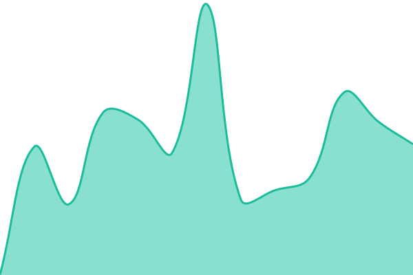
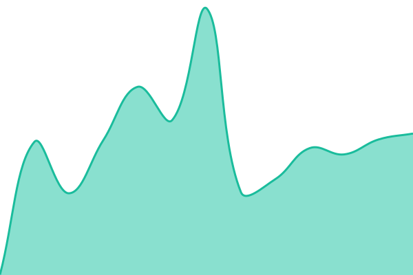

# [📈 Live Status](https://demo.upptime.js.org): <!--live status--> **🟧 Partial outage**

This repository contains the open-source uptime monitor and status page for [Upptime](https://upptime.js.org), powered by [Upptime](https://github.com/upptime/upptime).

With [Upptime](https://upptime.js.org), you can get your own unlimited and free uptime monitor and status page, powered entirely by a GitHub repository. We use [Issues](https://github.com/upptime/upptime/issues) as incident reports, [Actions](https://github.com/AlonsoK28/xadani-upptime/actions) as uptime monitors, and [Pages](https://demo.upptime.js.org) for the status page.

<!--start: status pages-->
<!-- This summary is generated by Upptime (https://github.com/upptime/upptime) -->
<!-- Do not edit this manually, your changes will be overwritten -->
<!-- prettier-ignore -->
| URL | Status | History | Response Time | Uptime |
| --- | ------ | ------- | ------------- | ------ |
|  [xadani](https://www.xadani.com.mx) | 🟩 Up | [xadani.yml](https://github.com/AlonsoK28/xadani-upptime/commits/HEAD/history/xadani.yml) | 

 482ms
     
 | 

<a href="https://AlonsoK28.github.io/xadani-upptime/history/xadani">41.27%</a>
    

|  xadani-ftp | 🟥 Down | [xadani-ftp.yml](https://github.com/AlonsoK28/xadani-upptime/commits/HEAD/history/xadani-ftp.yml) | 

 0ms
     
 | 

<a href="https://AlonsoK28.github.io/xadani-upptime/history/xadani-ftp">0.00%</a>
    

|  [xadani-api](https://www.xadani.com.mx/api/producto/cajas%20de%20plastico) | 🟩 Up | [xadani-api.yml](https://github.com/AlonsoK28/xadani-upptime/commits/HEAD/history/xadani-api.yml) | 

 325ms
     
 | 

<a href="https://AlonsoK28.github.io/xadani-upptime/history/xadani-api">41.84%</a>
    

|  xadani-email | 🟥 Down | [xadani-email.yml](https://github.com/AlonsoK28/xadani-upptime/commits/HEAD/history/xadani-email.yml) | 

 239ms
     
 | 

<a href="https://AlonsoK28.github.io/xadani-upptime/history/xadani-email">100.00%</a>
    

|  [xadani-stripe-create-chekout](https://www.xadani.com.mx/create-checkout-stripe) | 🟩 Up | [xadani-stripe-create-chekout.yml](https://github.com/AlonsoK28/xadani-upptime/commits/HEAD/history/xadani-stripe-create-chekout.yml) | 

 232ms
     
 | 

<a href="https://AlonsoK28.github.io/xadani-upptime/history/xadani-stripe-create-chekout">42.97%</a>
    

|  [xadani-stripe-create-payment-intent](https://www.xadani.com.mx/create-payment-intent) | 🟩 Up | [xadani-stripe-create-payment-intent.yml](https://github.com/AlonsoK28/xadani-upptime/commits/HEAD/history/xadani-stripe-create-payment-intent.yml) | 

 242ms
     
 | 

<a href="https://AlonsoK28.github.io/xadani-upptime/history/xadani-stripe-create-payment-intent">43.54%</a>
    

|  [xadani-stripe-checkout-form](https://www.xadani.com.mx/checkout) | 🟩 Up | [xadani-stripe-checkout-form.yml](https://github.com/AlonsoK28/xadani-upptime/commits/HEAD/history/xadani-stripe-checkout-form.yml) | 

 310ms
     
 | 

<a href="https://AlonsoK28.github.io/xadani-upptime/history/xadani-stripe-checkout-form">44.12%</a>
    

|  [xadani-stripe-checkout-form-by-id-price-checker-1](https://www.xadani.com.mx/checkout-product/verificador-de-precios-modelo-empresarial/) | 🟩 Up | [xadani-stripe-checkout-form-by-id-price-checker-1.yml](https://github.com/AlonsoK28/xadani-upptime/commits/HEAD/history/xadani-stripe-checkout-form-by-id-price-checker-1.yml) | 

 321ms
     
 | 

<a href="https://AlonsoK28.github.io/xadani-upptime/history/xadani-stripe-checkout-form-by-id-price-checker-1">44.70%</a>
    

|  [sterilite-stripe-checkout-form-by-id-price-checker-2](https://www.xadani.com.mx/checkout-product/dispositivo-verificador-de-precios-modelo-profesional/) | 🟩 Up | [sterilite-stripe-checkout-form-by-id-price-checker-2.yml](https://github.com/AlonsoK28/xadani-upptime/commits/HEAD/history/sterilite-stripe-checkout-form-by-id-price-checker-2.yml) | 

 282ms
     
 | 

<a href="https://AlonsoK28.github.io/xadani-upptime/history/sterilite-stripe-checkout-form-by-id-price-checker-2">100.00%</a>
    

|  [xadani-stripe-checkout-form-by-code](https://www.xadani.com.mx/checkout-products/18/21/22/3/) | 🟩 Up | [xadani-stripe-checkout-form-by-code.yml](https://github.com/AlonsoK28/xadani-upptime/commits/HEAD/history/xadani-stripe-checkout-form-by-code.yml) | 

 291ms
     
 | 

<a href="https://AlonsoK28.github.io/xadani-upptime/history/xadani-stripe-checkout-form-by-code">45.85%</a>
    

|  [xadani-stripe-order-details](https://www.xadani.com.mx/v2/order-details/pi_3SQGuWPA8RIEn4T31Y9oW0wQ) | 🟩 Up | [xadani-stripe-order-details.yml](https://github.com/AlonsoK28/xadani-upptime/commits/HEAD/history/xadani-stripe-order-details.yml) | 

 319ms
     
 | 

<a href="https://AlonsoK28.github.io/xadani-upptime/history/xadani-stripe-order-details">46.43%</a>
    

|  [xadani-stripe-webhook](https://www.xadani.com.mx/webhook-stripe) | 🟩 Up | [xadani-stripe-webhook.yml](https://github.com/AlonsoK28/xadani-upptime/commits/HEAD/history/xadani-stripe-webhook.yml) | 

 218ms
     
 | 

<a href="https://AlonsoK28.github.io/xadani-upptime/history/xadani-stripe-webhook">47.00%</a>
    

|  [xadani-admin-api-batch](https://www.xadani.com.mx/modulos/controller/api/v2/batch.php) | 🟩 Up | [xadani-admin-api-batch.yml](https://github.com/AlonsoK28/xadani-upptime/commits/HEAD/history/xadani-admin-api-batch.yml) | 

 217ms
     
 | 

<a href="https://AlonsoK28.github.io/xadani-upptime/history/xadani-admin-api-batch">47.58%</a>
    

|  [xadani-api-shipping-details-by-code](https://www.xadani.com.mx/api/v2/checkout/shipping-details-by-zip-code/01010) | 🟥 Down | [xadani-api-shipping-details-by-code.yml](https://github.com/AlonsoK28/xadani-upptime/commits/HEAD/history/xadani-api-shipping-details-by-code.yml) | 

 187ms
     
 | 

<a href="https://AlonsoK28.github.io/xadani-upptime/history/xadani-api-shipping-details-by-code">100.00%</a>
    

|  [xadani-admin-api-keywords](https://www.xadani.com.mx/modulos/controller/api/v2/keywords.php) | 🟩 Up | [xadani-admin-api-keywords.yml](https://github.com/AlonsoK28/xadani-upptime/commits/HEAD/history/xadani-admin-api-keywords.yml) | 

 204ms
     
 | 

<a href="https://AlonsoK28.github.io/xadani-upptime/history/xadani-admin-api-keywords">48.71%</a>
    

|  [xadani-product-1](https://www.xadani.com.mx/griddler-de-color-plata/p) | 🟩 Up | [xadani-product-1.yml](https://github.com/AlonsoK28/xadani-upptime/commits/HEAD/history/xadani-product-1.yml) | 

 322ms
     
 | 

<a href="https://AlonsoK28.github.io/xadani-upptime/history/xadani-product-1">49.28%</a>
    

|  [xadani-product-2](https://www.xadani.com.mx/dispensador-de-doble-camara/p) | 🟩 Up | [xadani-product-2.yml](https://github.com/AlonsoK28/xadani-upptime/commits/HEAD/history/xadani-product-2.yml) | 

 321ms
     
 | 

<a href="https://AlonsoK28.github.io/xadani-upptime/history/xadani-product-2">49.86%</a>
    

|  [xadani-service-1-title](https://www.xadani.com.mx/servicio-de-instalacion-de-barreras-vehiculares/s) | 🟩 Up | [xadani-service-1-title.yml](https://github.com/AlonsoK28/xadani-upptime/commits/HEAD/history/xadani-service-1-title.yml) | 

 360ms
     
 | 

<a href="https://AlonsoK28.github.io/xadani-upptime/history/xadani-service-1-title">50.43%</a>
    

|  [xadani-service-1-description](https://www.xadani.com.mx/servicio-de-instalacion-de-barreras-vehiculares/s) | 🟩 Up | [xadani-service-1-description.yml](https://github.com/AlonsoK28/xadani-upptime/commits/HEAD/history/xadani-service-1-description.yml) | 

 339ms
     
 | 

<a href="https://AlonsoK28.github.io/xadani-upptime/history/xadani-service-1-description">51.01%</a>
    

|  [xadani-service-2-title](https://www.xadani.com.mx/instalacion-plafon-corrido/s) | 🟩 Up | [xadani-service-2-title.yml](https://github.com/AlonsoK28/xadani-upptime/commits/HEAD/history/xadani-service-2-title.yml) | 

 356ms
     
 | 

<a href="https://AlonsoK28.github.io/xadani-upptime/history/xadani-service-2-title">51.59%</a>
    

|  [xadani-service-2-description](https://www.xadani.com.mx/instalacion-plafon-corrido/s) | 🟩 Up | [xadani-service-2-description.yml](https://github.com/AlonsoK28/xadani-upptime/commits/HEAD/history/xadani-service-2-description.yml) | 

 304ms
     
 | 

<a href="https://AlonsoK28.github.io/xadani-upptime/history/xadani-service-2-description">52.16%</a>
    

|  [xadani-ecommerce](https://www.xadani.com.mx/mi-ecommerce.html) | 🟩 Up | [xadani-ecommerce.yml](https://github.com/AlonsoK28/xadani-upptime/commits/HEAD/history/xadani-ecommerce.yml) | 

 300ms
     
 | 

<a href="https://AlonsoK28.github.io/xadani-upptime/history/xadani-ecommerce">52.74%</a>
    

|  [xadani-list-1](https://www.xadani.com.mx/caja-transparente/l) | 🟩 Up | [xadani-list-1.yml](https://github.com/AlonsoK28/xadani-upptime/commits/HEAD/history/xadani-list-1.yml) | 

 490ms
     
 | 

<a href="https://AlonsoK28.github.io/xadani-upptime/history/xadani-list-1">53.31%</a>
    

|  [xadani-cotizacion](https://www.xadani.com.mx/cotizacion.html) | 🟩 Up | [xadani-cotizacion.yml](https://github.com/AlonsoK28/xadani-upptime/commits/HEAD/history/xadani-cotizacion.yml) | 

 236ms
     
 | 

<a href="https://AlonsoK28.github.io/xadani-upptime/history/xadani-cotizacion">53.89%</a>
    

|  [xadani-contacto](https://www.xadani.com.mx/contacto.html) | 🟩 Up | [xadani-contacto.yml](https://github.com/AlonsoK28/xadani-upptime/commits/HEAD/history/xadani-contacto.yml) | 

 276ms
     
 | 

<a href="https://AlonsoK28.github.io/xadani-upptime/history/xadani-contacto">56.87%</a>
    

|  [xadani-categoria](https://www.xadani.com.mx/categoria/hogar/pagina1.html) | 🟩 Up | [xadani-categoria.yml](https://github.com/AlonsoK28/xadani-upptime/commits/HEAD/history/xadani-categoria.yml) | 

 457ms
     
 | 

<a href="https://AlonsoK28.github.io/xadani-upptime/history/xadani-categoria">57.44%</a>
    

|  [xadani-subcategoria](https://www.xadani.com.mx/subcategoria/almacenamiento/pagina1.html) | 🟩 Up | [xadani-subcategoria.yml](https://github.com/AlonsoK28/xadani-upptime/commits/HEAD/history/xadani-subcategoria.yml) | 

 495ms
     
 | 

<a href="https://AlonsoK28.github.io/xadani-upptime/history/xadani-subcategoria">58.02%</a>
    

|  [xadani-search](https://www.xadani.com.mx/search?q=caja+de+plastico) | 🟩 Up | [xadani-search.yml](https://github.com/AlonsoK28/xadani-upptime/commits/HEAD/history/xadani-search.yml) | 

 525ms
     
 | 

<a href="https://AlonsoK28.github.io/xadani-upptime/history/xadani-search">58.59%</a>
    

|  [xadani-marca](https://www.xadani.com.mx/marca/sterilite/pagina1.html) | 🟩 Up | [xadani-marca.yml](https://github.com/AlonsoK28/xadani-upptime/commits/HEAD/history/xadani-marca.yml) | 

 529ms
     
 | 

<a href="https://AlonsoK28.github.io/xadani-upptime/history/xadani-marca">59.17%</a>
    

|  [xadani-subscription](https://www.xadani.com.mx/subscription/cs_live_a1l93RxXyTnP9j1bcOHJQeSDNVH4akRDW1hY77jZChmpwevh2UG6I9iCKz) | 🟩 Up | [xadani-subscription.yml](https://github.com/AlonsoK28/xadani-upptime/commits/HEAD/history/xadani-subscription.yml) | 

 1872ms
     
 | 

<a href="https://AlonsoK28.github.io/xadani-upptime/history/xadani-subscription">59.74%</a>
    

|  [cajas-de-plastico](https://cajas-de-plastico.com) | 🟩 Up | [cajas-de-plastico.yml](https://github.com/AlonsoK28/xadani-upptime/commits/HEAD/history/cajas-de-plastico.yml) | 

 746ms
     
 | 

<a href="https://AlonsoK28.github.io/xadani-upptime/history/cajas-de-plastico">60.32%</a>
    

|  [cajas-de-plastico-api](https://cajas-de-plastico.com/api/producto/cajas%20de%20plastico) | 🟩 Up | [cajas-de-plastico-api.yml](https://github.com/AlonsoK28/xadani-upptime/commits/HEAD/history/cajas-de-plastico-api.yml) | 

 264ms
     
 | 

<a href="https://AlonsoK28.github.io/xadani-upptime/history/cajas-de-plastico-api">60.89%</a>
    

|  [cajas-de-plastico-admin-api-batch](https://cajas-de-plastico.com/modulos/controller/api/v2/batch.php) | 🟩 Up | [cajas-de-plastico-admin-api-batch.yml](https://github.com/AlonsoK28/xadani-upptime/commits/HEAD/history/cajas-de-plastico-admin-api-batch.yml) | 

 635ms
     
 | 

<a href="https://AlonsoK28.github.io/xadani-upptime/history/cajas-de-plastico-admin-api-batch">61.47%</a>
    

|  [cajas-de-plastico-admin-api-keywords](https://cajas-de-plastico.com/modulos/controller/api/v2/keywords.php) | 🟩 Up | [cajas-de-plastico-admin-api-keywords.yml](https://github.com/AlonsoK28/xadani-upptime/commits/HEAD/history/cajas-de-plastico-admin-api-keywords.yml) | 

 225ms
     
 | 

<a href="https://AlonsoK28.github.io/xadani-upptime/history/cajas-de-plastico-admin-api-keywords">62.04%</a>
    

|  [cajas-de-plastico-product-1](https://cajas-de-plastico.com/contenedor-de-almacenamiento-apilable-rubbermaid/p) | 🟩 Up | [cajas-de-plastico-product-1.yml](https://github.com/AlonsoK28/xadani-upptime/commits/HEAD/history/cajas-de-plastico-product-1.yml) | 

 398ms
     
 | 

<a href="https://AlonsoK28.github.io/xadani-upptime/history/cajas-de-plastico-product-1">62.62%</a>
    

|  [cajas-de-plastico-product-2](https://cajas-de-plastico.com/cajas-de-almacenamiento-con-cerradura-de-24-galones-rubbermaid/p) | 🟩 Up | [cajas-de-plastico-product-2.yml](https://github.com/AlonsoK28/xadani-upptime/commits/HEAD/history/cajas-de-plastico-product-2.yml) | 

 335ms
     
 | 

<a href="https://AlonsoK28.github.io/xadani-upptime/history/cajas-de-plastico-product-2">63.19%</a>
    

|  [cajas-de-plastico-list-1](https://cajas-de-plastico.com/catalogo-de-cajas-de-almacenamiento-de-la-marca-rubbermaid/l) | 🟩 Up | [cajas-de-plastico-list-1.yml](https://github.com/AlonsoK28/xadani-upptime/commits/HEAD/history/cajas-de-plastico-list-1.yml) | 

 495ms
     
 | 

<a href="https://AlonsoK28.github.io/xadani-upptime/history/cajas-de-plastico-list-1">63.77%</a>
    

|  [cajas-de-plastico-search](https://cajas-de-plastico.com/search?q=cajonera) | 🟩 Up | [cajas-de-plastico-search.yml](https://github.com/AlonsoK28/xadani-upptime/commits/HEAD/history/cajas-de-plastico-search.yml) | 

 364ms
     
 | 

<a href="https://AlonsoK28.github.io/xadani-upptime/history/cajas-de-plastico-search">64.35%</a>
    

|  [barreras-vehiculares](https://barreras-vehiculares.mx) | 🟩 Up | [barreras-vehiculares.yml](https://github.com/AlonsoK28/xadani-upptime/commits/HEAD/history/barreras-vehiculares.yml) | 

 884ms
     
 | 

<a href="https://AlonsoK28.github.io/xadani-upptime/history/barreras-vehiculares">64.92%</a>
    

|  [barreras-vehiculares-api](https://barreras-vehiculares.mx/api/producto/barreras) | 🟩 Up | [barreras-vehiculares-api.yml](https://github.com/AlonsoK28/xadani-upptime/commits/HEAD/history/barreras-vehiculares-api.yml) | 

 297ms
     
 | 

<a href="https://AlonsoK28.github.io/xadani-upptime/history/barreras-vehiculares-api">65.50%</a>
    

|  [barreras-vehiculares-admin-api-batch](https://barreras-vehiculares.mx/modulos/controller/api/v2/batch.php) | 🟩 Up | [barreras-vehiculares-admin-api-batch.yml](https://github.com/AlonsoK28/xadani-upptime/commits/HEAD/history/barreras-vehiculares-admin-api-batch.yml) | 

 283ms
     
 | 

<a href="https://AlonsoK28.github.io/xadani-upptime/history/barreras-vehiculares-admin-api-batch">66.07%</a>
    

|  [barreras-vehiculares-admin-api-keywords](https://barreras-vehiculares.mx/modulos/controller/api/v2/keywords.php) | 🟩 Up | [barreras-vehiculares-admin-api-keywords.yml](https://github.com/AlonsoK28/xadani-upptime/commits/HEAD/history/barreras-vehiculares-admin-api-keywords.yml) | 

 256ms
     
 | 

<a href="https://AlonsoK28.github.io/xadani-upptime/history/barreras-vehiculares-admin-api-keywords">66.65%</a>
    

|  [barreras-vehiculares-product-1](https://barreras-vehiculares.mx/barrera-vehicular-automatica-gard8-para-mastil-de-hasta-7-metros-came/p) | 🟩 Up | [barreras-vehiculares-product-1.yml](https://github.com/AlonsoK28/xadani-upptime/commits/HEAD/history/barreras-vehiculares-product-1.yml) | 

 357ms
     
 | 

<a href="https://AlonsoK28.github.io/xadani-upptime/history/barreras-vehiculares-product-1">67.22%</a>
    

|  [barreras-vehiculares-product-2](https://barreras-vehiculares.mx/barrera-vehicular-came-alto-rendimiento-con-brazo-de-hasta-4-mts/p) | 🟩 Up | [barreras-vehiculares-product-2.yml](https://github.com/AlonsoK28/xadani-upptime/commits/HEAD/history/barreras-vehiculares-product-2.yml) | 

 374ms
     
 | 

<a href="https://AlonsoK28.github.io/xadani-upptime/history/barreras-vehiculares-product-2">67.80%</a>
    

|  [barreras-vehiculares-service-1-title](https://barreras-vehiculares.mx/instalacion-de-barreras-vehiculares/s) | 🟩 Up | [barreras-vehiculares-service-1-title.yml](https://github.com/AlonsoK28/xadani-upptime/commits/HEAD/history/barreras-vehiculares-service-1-title.yml) | 

 438ms
     
 | 

<a href="https://AlonsoK28.github.io/xadani-upptime/history/barreras-vehiculares-service-1-title">68.38%</a>
    

|  [barreras-vehiculares-service-1-description](https://barreras-vehiculares.mx/instalacion-de-barreras-vehiculares/s) | 🟩 Up | [barreras-vehiculares-service-1-description.yml](https://github.com/AlonsoK28/xadani-upptime/commits/HEAD/history/barreras-vehiculares-service-1-description.yml) | 

 350ms
     
 | 

<a href="https://AlonsoK28.github.io/xadani-upptime/history/barreras-vehiculares-service-1-description">68.95%</a>
    

|  [barreras-vehiculares-service-2-title](https://barreras-vehiculares.mx/servicio-de-instalacion-de-barreras-vehiculares-en-zonas-residenciales/s) | 🟩 Up | [barreras-vehiculares-service-2-title.yml](https://github.com/AlonsoK28/xadani-upptime/commits/HEAD/history/barreras-vehiculares-service-2-title.yml) | 

 385ms
     
 | 

<a href="https://AlonsoK28.github.io/xadani-upptime/history/barreras-vehiculares-service-2-title">69.53%</a>
    

|  [barreras-vehiculares-service-2-description](https://barreras-vehiculares.mx/servicio-de-instalacion-de-barreras-vehiculares-en-zonas-residenciales/s) | 🟩 Up | [barreras-vehiculares-service-2-description.yml](https://github.com/AlonsoK28/xadani-upptime/commits/HEAD/history/barreras-vehiculares-service-2-description.yml) | 

 356ms
     
 | 

<a href="https://AlonsoK28.github.io/xadani-upptime/history/barreras-vehiculares-service-2-description">70.58%</a>
    

|  [barreras-vehiculares-search](https://barreras-vehiculares.mx/search?q=barrera) | 🟩 Up | [barreras-vehiculares-search.yml](https://github.com/AlonsoK28/xadani-upptime/commits/HEAD/history/barreras-vehiculares-search.yml) | 

 415ms
     
 | 

<a href="https://AlonsoK28.github.io/xadani-upptime/history/barreras-vehiculares-search">70.96%</a>
    

|  [verificador-precios](https://verificador-precios.mx) | 🟩 Up | [verificador-precios.yml](https://github.com/AlonsoK28/xadani-upptime/commits/HEAD/history/verificador-precios.yml) | 

 350ms
     
 | 

<a href="https://AlonsoK28.github.io/xadani-upptime/history/verificador-precios">100.00%</a>
    

|  [verificador-precios software](https://verificador-precios.mx/software/) | 🟩 Up | [verificador-precios-software.yml](https://github.com/AlonsoK28/xadani-upptime/commits/HEAD/history/verificador-precios-software.yml) | 

 230ms
     
 | 

<a href="https://AlonsoK28.github.io/xadani-upptime/history/verificador-precios-software">100.00%</a>
    

|  [verificador-precios pospal](https://verificador-precios.mx/verificador-precios-integracion-pospal/) | 🟩 Up | [verificador-precios-pospal.yml](https://github.com/AlonsoK28/xadani-upptime/commits/HEAD/history/verificador-precios-pospal.yml) | 

 243ms
     
 | 

<a href="https://AlonsoK28.github.io/xadani-upptime/history/verificador-precios-pospal">100.00%</a>
    

|  [xa-cloudinary-api-rest-ping](https://xa-cloudinary-api-rest-ffcgdggedsgzajdg.canadacentral-01.azurewebsites.net/ping) | 🟩 Up | [xa-cloudinary-api-rest-ping.yml](https://github.com/AlonsoK28/xadani-upptime/commits/HEAD/history/xa-cloudinary-api-rest-ping.yml) | 

 10754ms
     
 | 

<a href="https://AlonsoK28.github.io/xadani-upptime/history/xa-cloudinary-api-rest-ping">100.00%</a>
    

|  [xa-cloudinary-api-rest-by-prefix](https://xa-cloudinary-api-rest-ffcgdggedsgzajdg.canadacentral-01.azurewebsites.net/api/cloudinary-images/by-prefix/44) | 🟩 Up | [xa-cloudinary-api-rest-by-prefix.yml](https://github.com/AlonsoK28/xadani-upptime/commits/HEAD/history/xa-cloudinary-api-rest-by-prefix.yml) | 

 1635ms
     
 | 

<a href="https://AlonsoK28.github.io/xadani-upptime/history/xa-cloudinary-api-rest-by-prefix">100.00%</a>
    

|  [xa-cloudinary-api-rest-delete](https://xa-cloudinary-api-rest-ffcgdggedsgzajdg.canadacentral-01.azurewebsites.net/api/cloudinary-images/55555666-1) | 🟩 Up | [xa-cloudinary-api-rest-delete.yml](https://github.com/AlonsoK28/xadani-upptime/commits/HEAD/history/xa-cloudinary-api-rest-delete.yml) | 

 351ms
     
 | 

<a href="https://AlonsoK28.github.io/xadani-upptime/history/xa-cloudinary-api-rest-delete">100.00%</a>
    

|  [xa-cloudinary-api-rest-rename](https://xa-cloudinary-api-rest-ffcgdggedsgzajdg.canadacentral-01.azurewebsites.net/api/cloudinary-images/55555666-333/rename) | 🟩 Up | [xa-cloudinary-api-rest-rename.yml](https://github.com/AlonsoK28/xadani-upptime/commits/HEAD/history/xa-cloudinary-api-rest-rename.yml) | 

 289ms
     
 | 

<a href="https://AlonsoK28.github.io/xadani-upptime/history/xa-cloudinary-api-rest-rename">100.00%</a>
    

|  [xa-cloudinary-api-rest-batch-upload](https://xa-cloudinary-api-rest-ffcgdggedsgzajdg.canadacentral-01.azurewebsites.net/api/cloudinary-images/upload-batch) | 🟩 Up | [xa-cloudinary-api-rest-batch-upload.yml](https://github.com/AlonsoK28/xadani-upptime/commits/HEAD/history/xa-cloudinary-api-rest-batch-upload.yml) | 

 238ms
     
 | 

<a href="https://AlonsoK28.github.io/xadani-upptime/history/xa-cloudinary-api-rest-batch-upload">100.00%</a>
    

<!--end: status pages-->

[**Go to xadani-upptime status website →**](https://alonsok28.github.io/xadani-upptime/)

## 📄 License

- Powered by: [Upptime](https://github.com/upptime/upptime)
- Code: [MIT](./LICENSE) © [Upptime](https://upptime.js.org)
- Data in the `./history` directory: [Open Database License](https://opendatacommons.org/licenses/odbl/1-0/)
